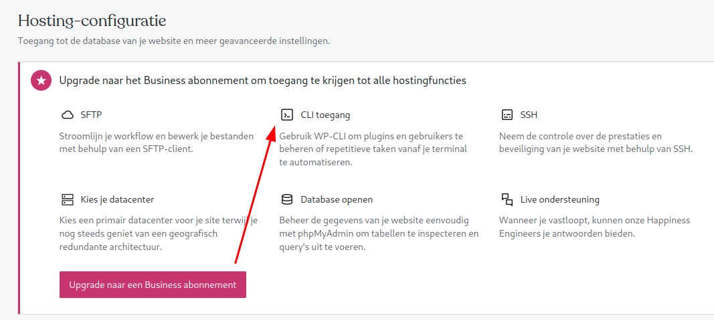

Sinds ik mn nieuwe NAS van Synology heb ([DS920+](https://www.synology.com/nl-nl/products/DS920+)) ga ik helemaal los met docker. Ik heb ondertussen het volgende draaien :

screenie van dockers

- [Sonarr](https://sonarr.tv/) (tv sersies)
- [Radarr](https://radarr.video/) (films)
- [Jackett](https://github.com/Jackett/Jackett) (indexer proxy)
- [Deluge](https://www.deluge-torrent.org/) (download client)
- [Bazarr](https://www.bazarr.media/) (ondertitels)
- [soulseek](https://github.com/jpdillingham/Soulseek.NET) (muziek)
- [lazylibrarian](https://lazylibrarian.gitlab.io/) (boeken)
- [Readarr](https://readarr.com/) (boeken)
- [Grafana](https://grafana.com/) (met influxdb en [synology dashboard](https://grafana.com/grafana/dashboards/1727))
- [homeassistent](https://www.home-assistant.io/hassio/) (home automation)
- [unifi-poller](https://github.com/unifi-poller/unifi-poller) (WIFI controller monitoren)

Met Grafana de Synology monitoren was nogal een gedoe om SNMP aan de praat te krijgen. Alle configuraties heb ik in een private github repository. Misschien nog public maken.

En ben ik nog van plan om :

- de volleybal app (voor het plannen van scheidsrechters, zaaldienst en bardienst) te hosten
- jenkins, gitea en sonarqube
- met een postgresql database omgeving
- de raspberry pi 2 in de meterkast voor de Unifi controller vervangen.

Dit lijkt er op dat ik wel iets meer moet gaan hebben dan de 8gb aan memory die ik nu heb. Dus dat betekent de 4gb module vervangen door een [16gb](https://www.informatique.nl/197313/crucial-ddr4-16-gb-2666-mhz-cl19.html).
