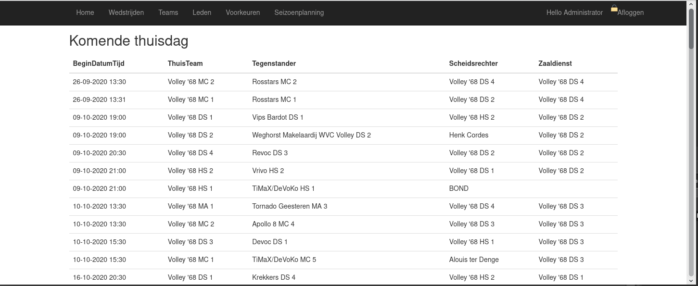
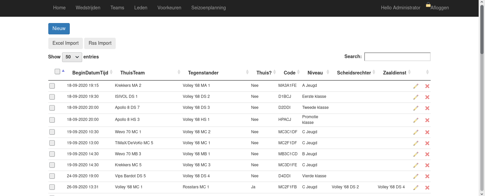
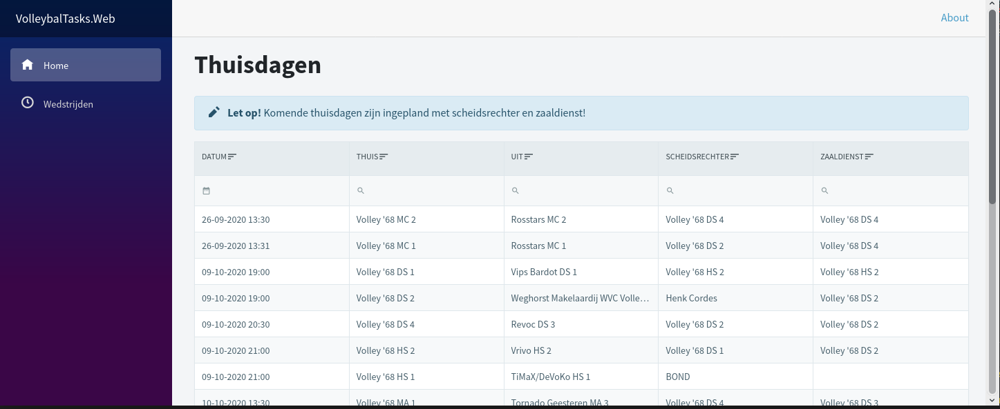
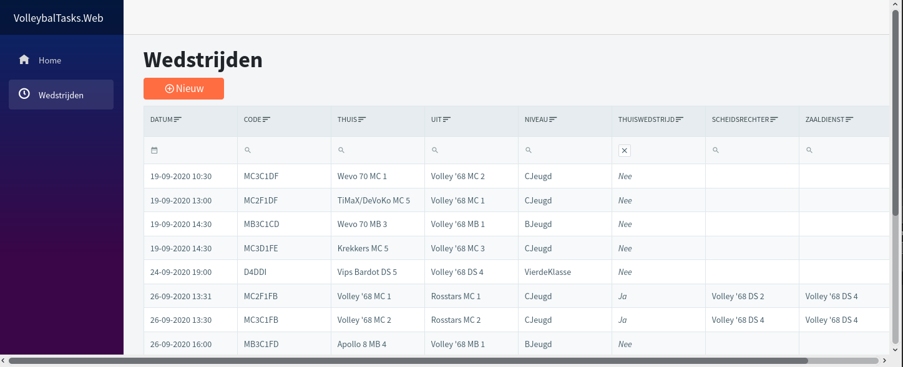

Momenteel ben ik bezig om de frontend van de volleybal app om te smurfen naar (serverside) [Blazor](https://dotnet.microsoft.com/apps/aspnet/web-apps/blazor). Want stiekem vind ik het best wel prettig dat ik geen javascript meer hoef te typen en dankzij gratis UI componenten (zoals [Radzen](https://razor.radzen.com/)) hoef ik me ook niet bezig te houden met lastige frontend magic 😜

Niet dat ik met de vorige frontend druk was... Gewoon de standaard bootstrap schil :

- 
    
- 
    

Dus echt aantrekkelijk is het allemaal niet, maar wel enigszins functioneel.

De Blazor standaard OOTB-frontend ziet er een stuk mooier uit vind ik. En de [Radzen](https://razor.radzen.com/) componenten zoals het grid en de modal dialog en de material design icons zijn ook feest :

- 
    
- 
    

Zoals je ziet een stuk gebruiksvriendelijker. Handig ook dat je in de grids kan zoeken met filters.

Modal dialog

Eigenlijk heb ik een hekel aan modal dialogs in een desktop applicatie, maar in een webzijde vind ik dat nogal prettig. Radzen heeft een dialogservice waar je gebruik van kan maken. Je inject in feite het dialog-component in je main layout. Zo gebruik ik een dialog om records te kunnen verwijderen. De DialogService moet je in de startup registeren :

```
services.AddScoped<DialogService>();
```

Vervolgens moet de dialog component nog in de body van MainLayout.razor :

```
<div class="content px-4">
    <RadzenDialog />
    @Body
</div>
```

Op de grid voeg ik dit toe :

```
AdditionalSourceCodePages="@(new List<string>() { "DeleteDialog.razor" })"
```

Op de pagina met de grid heb ik een delete knop met achterliggende functie. In die Delete functie doe ik :

```
bool verwijderd = await dialogService.OpenAsync<DeleteDialog>($"Lid {model.Id}", new Dictionary<string, object>() { { "Id", model.Id },{ "Entiteit", "Lid" } });
```

Ik open de dialogservice met mijn DeleteDialog-component, geef de Id en entiteitnaam mee en in de DeleteDialog verwijder ik die entiteit met dat id. De dialog heeft een controle vraag en een Ok en Annuleer-knop :

```
@inject DeleteService deleteService
@inject Radzen.DialogService dialogService

<RadzenCard Style="padding: 20px;">
    <p Style="margin-bottom: 10px;">Zeker weten dat je deze @(Entiteit) met id @(Id) wil verwijderen?</p>
    <div class="row">
        <RadzenButton Text="Ok" Click="()=> dialogService.Close(true)" Style="margin: 10px; width: 150px" />
        <RadzenButton Text="Annuleer" Click="()=> dialogService.Close(false)" ButtonStyle="ButtonStyle.Secondary"  Style="margin: 10px; width: 150px"/>
    </div>
</RadzenCard>
```

En de init van deze dialog-pagina koppelt het openen en sluiten van de dialoog aan een functie :

```
protected override async Task OnInitializedAsync()
{
    dialogService.OnOpen += VerwijderDialoogOpen;
    dialogService.OnClose += VerwijderDialoogSluit;
}
```

De VerwijderDialoogSluit roept voor een Entiteit met Id de deleteService aan om het object daadwerkelijk te verwijderen. Wanneer het record verwijderd is, kun je het record uit het grid verwijderen en reloaden. Dit alles zonder refresh van de pagina. Met C#! Zonder javascript te typen! Hoe vet!


Bestand downloaden

Wat ik maar niet voor elkaar kreeg was het downloaden van de csv die bij een seizoensplanning hoort. Er is zoals bij het oldscool MVC geen ActionResult waarmee je een file kan returnen. De way to go is een controller maken, speciaal voor het downloaden van bestanden naar de browser. Na een paar keer tegen een muur aangelopen en het ontbreken van de kennis om dit te fixen, heb ik de weg van de minste weerstand gekozen en dit component gebruikt : https://github.com/StefH/Blazor.DownloadFileFast

In plaats van een lastige constructie met een NavigationManager en redirecten naar een GET op de speciale downloadcontroller, hoef ik nu alleen maar dit te doen :

```
BlazorDownloadFileService.DownloadFileAsync($"wedstrijdplanning{model.Seizoen}-versie{model.Versie}.csv", model.Csv);
```

Et voila : een csv met daarin de wedstrijdplanning downloaden is een koekie :


Had ik al gezegd dat ik 0 javascript hoef te typen? Nee? Ha! Met c#! Hoe vet!
