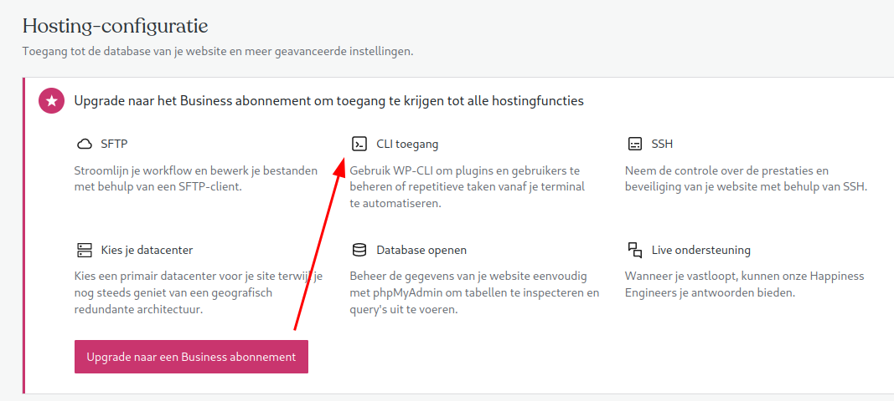
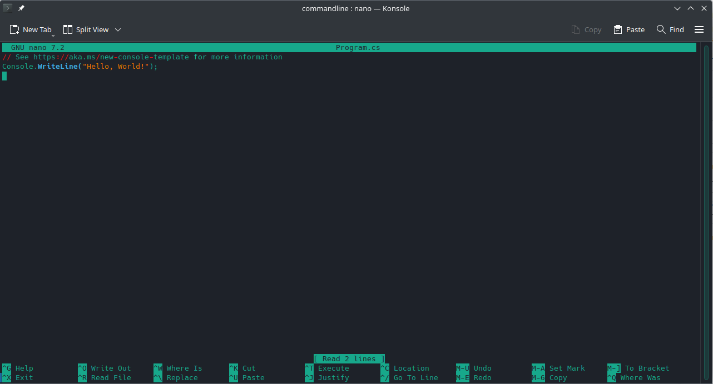
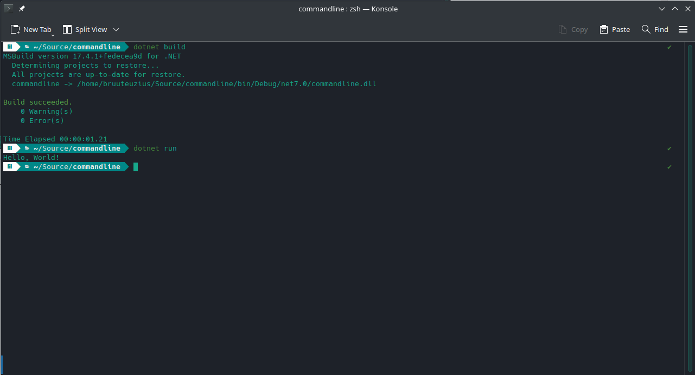

Is een tijd geleden dat ik iets heb gemaakt/gedaan/geknutseld dat ik waardig vond om te bloggen (voor mezelf een extra geheugensteuntje) maar dit is wel een mooi moment. Influxdb 2.0 upgrade stond me al een tijd tegen dat het zich ging gedragen als Microsoft SQL Server. Namelijk : geheugen vreten.

Het alternatief vond ik in Prometheus. Zeker toen een collega mij had gewezen op node\_exporter. Voor die tijd had ik wel Prometheus draaien, maar werkte niet lekker mijn mijn unifipoller\_exporter.

## Stap 1 Telegraf vervangen door node\_exporter

De raspberry pi's met libreelec (films en series kijken) in de woonkamer en op de slaapkamer, wil ik telegraf vervangen door node\_exporter voor Prometheus.

- ssh-en naar slaapkamer.local
- node\_exporter downloaden (`wget https://github.com/prometheus/node_exporter/releases/download/v1.3.1/node_exporter-1.3.1.linux-armv6.tar.gz`)
- uitpakken met tar (Xtract Ze File met een duits accent)
- node\_exporter naar root van /storage/ kopieren
- chmod +x node\_exporter
- /storage/.config/autostart.sh aanpassen :

(  
`sleep 10  
cd /storage`

./node\_exporter`  
)`

- node\_exporter starten
- testen :

- Prometheus.yml aanpassen :  
    \- `job_name: 'slaapkamerpi' scrape_interval: 15s static_configs:`
    - `targets: ['slaapkamerpi.local:9100']`

- prometheus herstarten

_E voila, metrics!_

## Stap 2 Grafana dashboard aanpassen

Met telegraf kreeg ik onder andere temperatuur van de raspberry pi's door, dus die ga ik opzoeken in de output van node\_exporter.

Gevonden!

Nu de datasource en query aanpassen in grafana :

## Conclusie

Tataaa, zo makkelijk was het dus :) Wel eniszins lastig om via een omweg (zonder service) node\_exporter te starten op een raspberry pi met libreelec, maar het is gelukt. Heb het idee dat de combinatie Prometheus en verschillende exporters ook veel lichter is voor de Synology NAS. Ik heb nog heel even cAdvisor gebruikt om de docker containers te monitoren, maar die deed bursts met CPU en MEM verbruik en had niet echt voordelen. Misschien dat ik nog een meer lichtgewicht exporter voor docker kan vinden.

Edit : Ondertussen heb ik een [docker\_exporter](https://github.com/prometheus-net/docker_exporter) gevonden die ook nog eens in C# is geschreven en werkt best mooi en ik heb mijn dashboard weer compleet :

