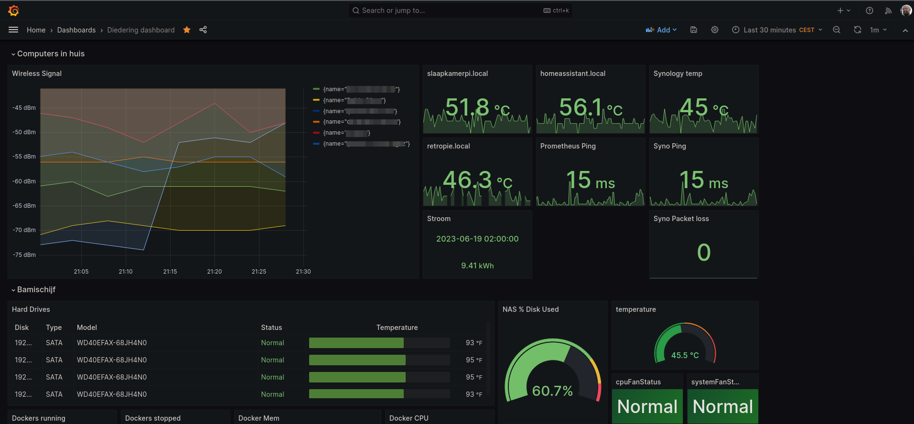

Ok iets specifieker : ik schrijf deze blogpost nu in mijn (nieuwe) favoriete browser Firefox. Maar zou ik de blogpost ook kunnen ver typen in de terminal? Dat kan, met [wp-cli](https://wp-cli.org/), maar helaas niet voor deze website want ik ben (nog) niet van plan om te gaan betalen 😉


Maar waarom zou ik dit in godesnaam willen? Ten eerste omdat het kan, ten tweede : ik luisterde naar de podcast Linux Downtime en daar hadden ze het er over. Ik kan niet wachten tot de uitzending komt waarin ze dat gaan proberen, dus ik ben zelf maar alvast begonnen.

Wat zou ik willen kunnen doen in de commandline?

- c# dotnet development

- mail checken

- status bekijken van de prometheus-targets op mijn NAS

- ...

## C# dotnet development

Heel simpel, gewoon in een nieuwe folder : `dotnet new console ditiseentest`

Maar dan wil ik de code editten en dat kan natuurlijk niet in vscode (wat ik normaal doe) maar dan moet ik een commandline text-editor gebruiken. Ik gebruik nooit vim (of emacs). Tenminste, ik gebruik wel [vimium](https://chrome.google.com/webstore/detail/vimium/dbepggeogbaibhgnhhndojpepiihcmeb) in chrome als ik op de werklaptop zit en geen zin heb om te klikken 😁

Gelukkig heeft mijn goto-text editor nano ook color-bindings in `/usr/share/nano-syntax-highlighting/csharp.nanorc` ,zodat Program.cs van mijn dotnet 7 console-app er zo uit ziet :


En builden (dotnet build) of runnen kan ook (dotnet run) dankzij de dotnet CLI :


## Mail controleren

En hoe zit dat met mail controleren? Toevallig heb ik ooit eens over mutt gehoord. Geinstalleerd met `yay -Syu mutt` en daarna een `~/.muttrc` file gemaakt zoals hier:

https://gist.github.com/neutraltone/99a60aa58111f3f086f20039e8401154

Daarna kun je gewoon mutt starten vanaf de commandline en kun je de behulpzame email bekijken die je net hebt gekregen 😉 :


## Status van prometheus-targets bekijken

Op mijn NAS draaien nogal wat docker containers. Ook heb ik een paar raspberry pi's in huis draaien. Waar mogelijk heb ik een prometheus exporter geinstalleerd, zodat ik de boel een beetje in de gaten kan houden in een grafana dashboard :



In de commandline kan ik dan de API van prometheus aanroepen, bijvoorbeeld :

`curl 'http://bamischijf.local:9090/api/v1/query?query=up'` 

De output daarvan is niet helemaal lekker, eigenlijk wil ik alleen weten of al mn targets OK of niet O zijn :

```
#! /usr/bin/python
import requests
import json

json_file = 'http://bamischijf.local:9090/api/v1/query?query=up'
data = json.loads(requests.get(json_file).text)["data"] 
totaal = len(data['result'])
sum = 0
for target in data["result"]:
    sum += int(target['value'][1])

if sum.__eq__(totaal):
    print('Targets OK')
else:
    verschil = totaal - sum
    print(f"{verschil} Targets FAILED")
```

Tot zover deze blogpost. Om een beetje een idee te krijgen dat er een boel mogelijk is in de commandline 😁
