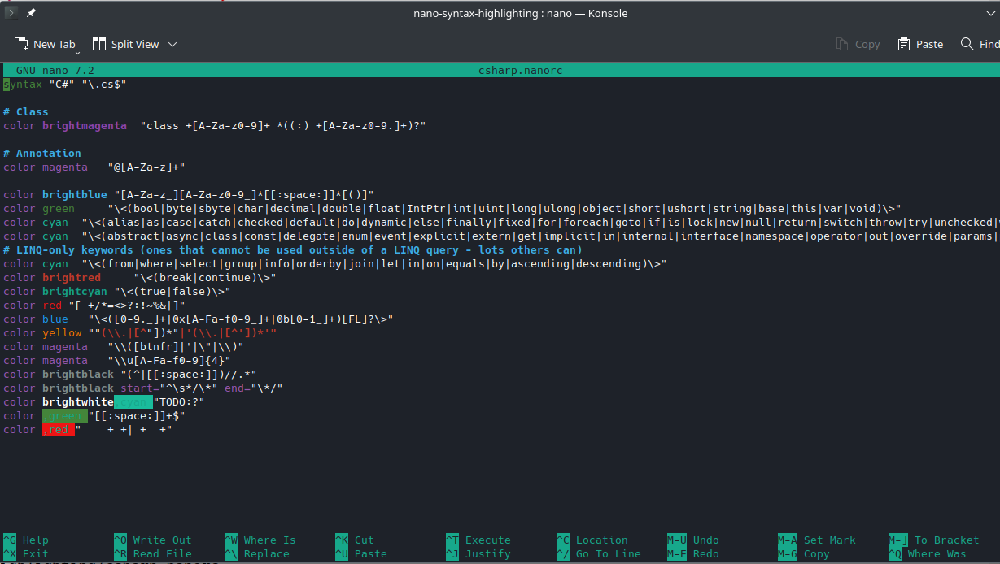
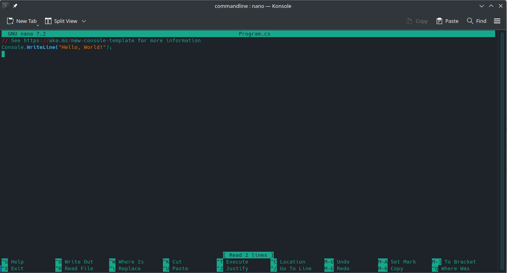
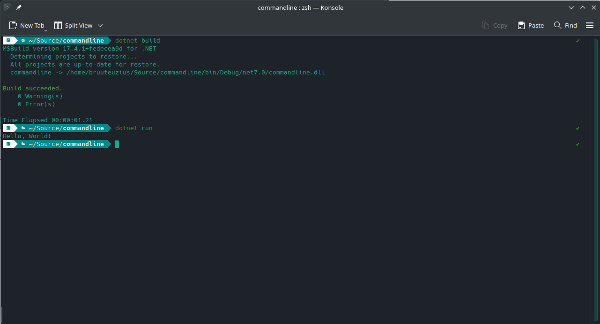

Sinds ik mijn DS920+ NAS van Synology heb, ben ik vaak druk met docker containers. Naast de gebruikelijke muziek/films/series download shizzle, had ik ook een docker-compose voor de combinatie grafana, influxdb1, telegraf en de unifi-poller. Dat werkte allemaal prima totdat ik het nodig vond om alle containers te updaten met de volgende commando's :

```
ssh username@nasip -p XXX
sudo -i
cd /volume1/docker
docker-compose -f docker-compose.grafana.yml down
docker pull -f docker-compose.grafana.yml
docker-compose -f docker-compose.grafana.yml up -d
```

Maar wist ik veel dat er een nieuwe major version van influxdb was die de huidige telegraf connecties en grafana dashboard datasources opfukte 😜 Alle dashboards die ik had deden het niet meer vanwege de nieuwe manier van authenticatie/authorizatie en de nieuwe werking van influxdb2 met buckets en tokens.

In deze blogpost verzamel ik de stappen die ik heb uitgevoerd om te zorgen dat ik uiteindelijk weer wat op een grafana-dashboard krijg.

### Eerst Telegraf

Sinds influxdb versie 2 (GA sinds 4 februari 2021) is er een andere manier van connecten en querien met Influxdb om data naartoe te sturen. Waar je eerder een databasenaam, retentie policy, username/password moet opgeven heb je nu dit :

```
[[outputs.influxdb_v2]]	
  urls = ["http://<nasip>:8086"]
  token = "hiereenlangetokendiejegenereerdininfluxdb"
  organization = "Diedering"
  bucket = "synology"
```

### Influxdb instellingen

Eigenlijk hadden we eerst in Influxdb een token moeten maken :


Deze token vul je in als environment variable op de machine waar telegraf geïnstalleerd staat, of copy paste de token gewoon in de telegraf.conf.

Een bucket is nodig om de timeseries informatie in op te slaan :



Vervolgens kun je bij Explore de queries bij elkaar klikken, zoals bijvoorbeeld percentage beschikbaar geheugen :



Als je links van de submit knop (query uitvoeren) op "Script editor"  klikt, kun je zien welke Flux-query je bij elkaar geklikt hebt :

```
from(bucket: "synology")
  |> range(start: v.timeRangeStart, stop: v.timeRangeStop)
  |> filter(fn: (r) => r["_measurement"] == "mem")
  |> filter(fn: (r) => r["_field"] == "available_percent")
  |> aggregateWindow(every: v.windowPeriod, fn: mean, createEmpty: false)
  |> yield(name: "mean")
```

Een andere manier om Flux queries te schrijven is met Visual Studio Code, met de Flux-extensie. Je kan vanuit daar een connectie leggen met je influxdb :



Het voordeel hiervan is, is dat je net zoals bij bijvoorbeeld C#, echte intellisense hebt. Dus aanvulling op de query die je typt.

## Grafana

Vervolgens kunnen we in grafana een dashboard maken. We gaan eerst een datasource toevoegen.


Anders dan bij InfluxDB 1.8 datasources, kies ik voor Flux als query language, vul ik na de url van InfluxDB 2.0, geen Auth waardes in. Wel kiezen we een token die we eerder in Influxdb hebben gemaakt en een bucket waar we de data uithalen voor ons grafiekje in een Grafana dashboard.

Op moment van het typen van deze blogpost, heb ik nog maar een paar meters/grafieken op het dashboard staan, maar daar komt tzt verandering in :


