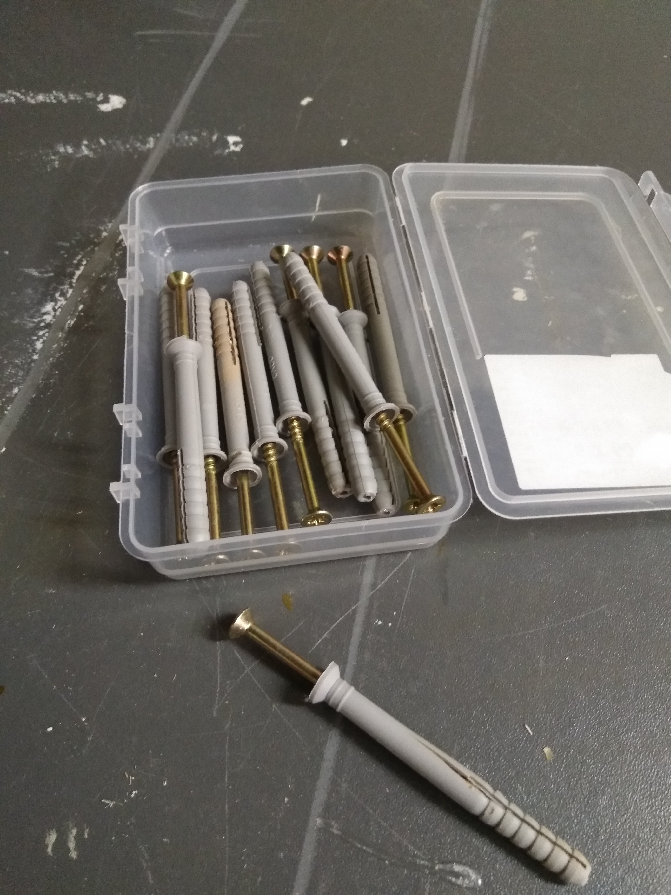
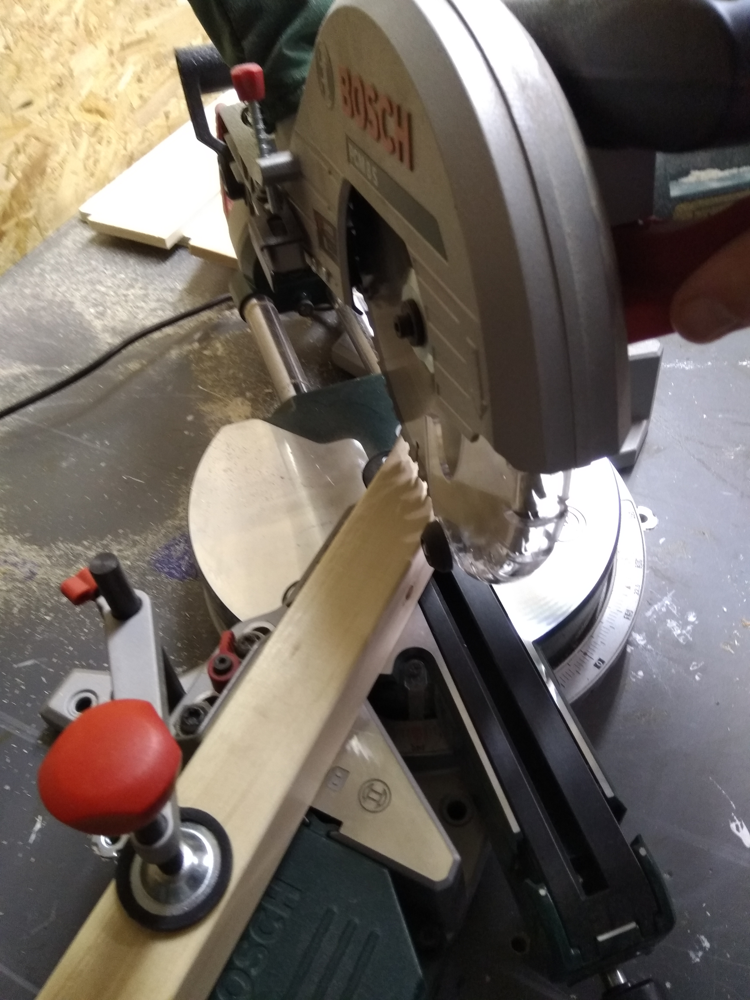
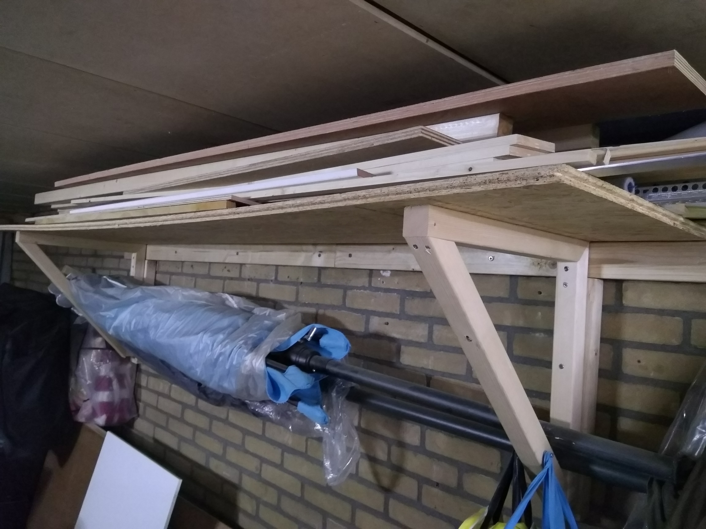
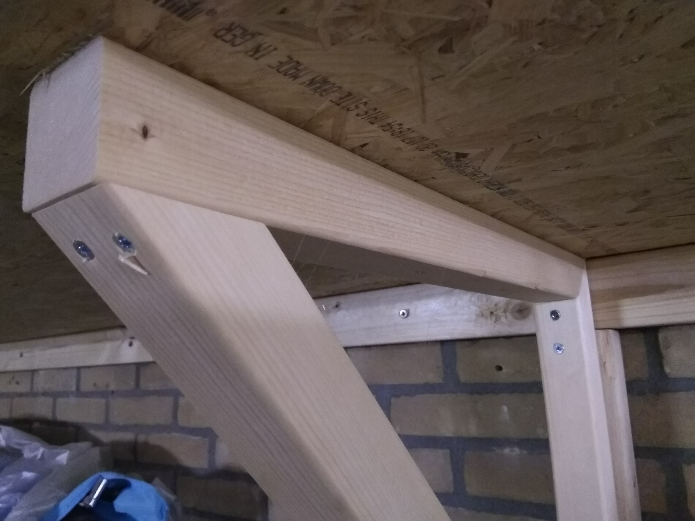

Alweer een paar week geleden ben ik druk geweest met een plateau waar ik hout en troep op kan gooien, zodat het niet zo in de weg ligt. Het leuke aan dit project is dat ik constructie pluggen heb gebruikt :

Superhandig want je boort dus een gat in steen met een steenboor (goh) en je boort een gat in het hout met een houtboor. Daarna de plug in het hout en in de muur slaan met een hamer en dan schroeven. Doordat de schroef in het plastisc gaat uitzetten, zet het zich schrap in de muur en het hout.

En voor de eerste keer sinds ik mijn afkort zaag heb, ook daadwerkelijk verstek heb gezaagd :)

Om van de zooi in de schuur, iets minder zooi te maken :

- 
    
- 
    

Volgende plan is een verreidbare bak waar ik kleinere stukken hout in kan leggen.
