## Bacdafucup
_Bacdafucup is een term die afkomstig is uit de hiphopcultuur en verwijst naar het maken van backups of het veiligstellen van gegevens. In de context van homelabs en technologie, betekent het simpelweg dat je regelmatig backups moet maken van je belangrijke bestanden, systemen en configuraties om te voorkomen dat je gegevens verliest bij een storing, hack of andere onvoorziene gebeurtenissen._

...aldus de autocomplete (met AI?) in Jetbrains Rider, na het typen van "bacdafucup" in deze oorspronkele markdown file :)
Maar het komt er wel redelijk in de buurt. Het is de titel van een album [album](https://en.wikipedia.org/wiki/Bacdafucup) van ONYX.
En dat je dingen moet backuppen is ook wel waar. Bacdafucup betekent volgens mij meer "aan de kant gaan" of zoals we in Twente zeggen "vort du!".
Enniehoe, deze blogpost gaat over backups maken. Ik heb nog geen idee wat ik allemaal moet of wil backuppen en hoe ik dat ga doen maar ik heb wel een paar ideeën.

1. Ik wil sowieso die bootlading aan foto's die op de nasischijf staan backuppen.
2. Op de nasischijf draaien een aantal applicaties, die databases hebben en wat configuratie, die wil ik denk ik ook niet kwijt.
3. Ik heb een backups pool gemaakt waar ik dingen in bewaar.

## Foto's
Voor foto's heb ik een pool gemaakt genaamd /pool/photos, daaronder heb ik datasets voor mijn vrouw en mezelf gemaakt. 
Bij elkaar dus 330GB op moment van typen. 

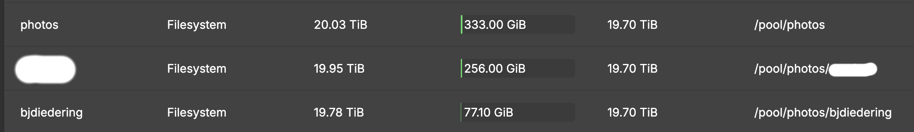

Maar! Ik heb een immich docker draaien en die heeft alle foto's van mijn telefoon en die van mijn vrouw opgeslagen, dus die moet ook gebackupped. Hoe ga ik dat doen? 
Scheduled job die foto's van die folders in de photos pool kopieert en daarna de hele bups backuppen?
Of een scheduled job die zowel photos pool backupped EN de immich folders (waar nieuwe foto's terechtkomen) ? 
En de database van immich dan? Moet ik die backuppen? Hey dat is handig, deze [blogpost](https://docs.immich.app/administration/backup-and-restore/) beschrijft precies dat. 
De documentatie loopt een beetje achter, je kan de maintenance settings nu vinden onder rechtsbovenin op je avatar klikken, Administration en dan Settings. 
Er worden default iedere nacht rond 02:00 backups gemaakt van de database en standaard is de retentie 14 dagen. 

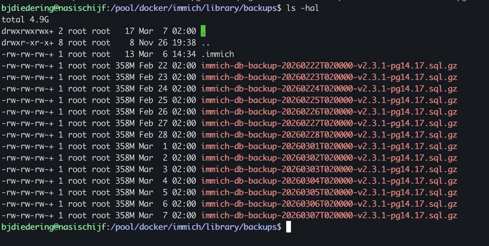

Ook een mooi doelwit voor de backups dus!

## Applicaties
Er zijn een aantal applicaties waarvan ik mogelijk wel de backups wil :

1. Home Assistant. Deze draait niet op de nasischijf, maar op een raspberry pi dus dat is een aparte uitdaging.
2. Unifi Controller. Is een docker container op de nasischijf. 
3. Postgres DWH. Jawel, je leest het goed, ik heb een datawarehouse draaien. Met data uit home assistant voor sensoren en energie verbruik enzo.
4. Mijn frigate server heeft een configuratie die ik misschien ook ergens moet opslaan. Misschien kan ik dat beter met een automatische commit naar github doen.
5. De PC van mijn vrouw en mijn 2 laptops. Maar dat heb ik nog nooit nodig gehad. De foto's die mijn vrouw op haar pc heeft zijn wel belangrijk.

## Backups data
De /pool/backups moet natuurlijk ook gebackupped worden. Ik denk dat ik alle database en applicatie backups daarheen gooi om de zoveel tijd.
Daarna moet die hele dataset ergens heen. Probleem is denk ik wel dat daar nu nog een hele verzameling games staat. Misschien moet die in een aparte dataset...
Dat maakt de hele backup dataset denk ik ook wat kleiner. Nadat ik via de UI een nieuwe dataset heb gemaakt : /pool/games, kan ik moven :

```
sudo mv /pool/backups/Games/* /pool/games/
```
Okay, dat was wel een goed idee. Ik heb blijkbaar `280 GB` aan games, waardoor ik slechts `11,3 GB` over heb aan backups :)

## Backup ideeën
Op dit moment kopieer ik 1x in de zoveel tijd (geen vaste planning) alle foto's naar een externe harde schijf.
Dat doe ik met de plugin USB Backup in OpenMediaVault. 
Supersimpel, ik plug de disk er in, de disk wordt automatisch gemount, gekopieerd, en ge-unmount en daarna kan ik de disk er weer uit trekken.

Het verdient geen schoonheidsprijs maar het is wel enigszins safe, want als ons huis affikt, dan hebben we in ieder geval de foto's nog veilig. 
Tenzij die USB stick nog bij ons thuis is. Maar die externe harde schijf ligt dus meestal bij mijn schoonmoeder. 
Niets ten nadele van mijn schoonmoeder, maar deze "offsite backup" is suboptimaal.

Hoe dan? Online storage? Ik heb al proton mail voor mezelf a 3 euro in de maand met 15gb opslag. 10 euro voor 500gb, of een dup pakket voor 15 euro per maand voor 2 personen en 2TB opslag.
Proton is misschien wel een idee voor mijn documenten zoals belastingpapieren et cetera... Of misschien configuraties. Want er Proton Drive heeft apps voor alle platformen.

> _08-03-2026 ondertussen heb ik een hetzner storage box gehuurd, kijk [deze](https://www.hetzner.com/storage/storage-box/) de BX11!_

Eerst is het van belang om SSH aan te zetten op Hetzner. Dat kan door naar je storage-box te gaan en onder `SSH Support` aan te klikken. 
Mijn storage-box heet Ultima Thule, naar deze [wiki](https://en.wikipedia.org/wiki/Thule) pagina, maar vooral vanwege de backup-site van Bill in de [Bobiverse](https://bobiverse.fandom.com/wiki/Ultima_Thule) boekenreeks.

Eerst een ssh key maken:
```
ssh-keygen -t ed25519 -f ~/.ssh/id_ed25519
```

Dan de key naar de storage box uploaden : 
```
cat ~/.ssh/id_ed25519.pub | ssh -p 23 uXXXXXX@uXXXXXX.YOUR-STORAGEBOX.DE install-ssh-key
```

Okay nu hebben we dus toegang tot de strorage box, nu nog iets verzinnen hoe ik backups maak en hoe ik de data daar krijg...
1. Alle bestanden per dataset (backups en photos) los naar Ultima Thule **SCP-en**. Dan moet ik een bash-script maken die ik kan schedulen met de cron-functie in OpenMediaVault.
2. Misschien kan ik de ZFS snapshot functie gebruiken en via **ZFS send/receive** de data naar Ultima Thule sturen. Dat lijkt me wel een stuk eleganter, maar ik weet niet of dat mogelijk is met een storage box van Hetzner. Hetzner moet wel ZFS receive ondersteunen en dat betwijfel ik.
3. Of ik maak lokaal een ZFS snapshot en sla die op als een bestand en **rsync** ik dat naar Ultima Thule.
4. Of ik gebruik de ingebakken **rsync** service van **OpenMediaVault** om de inhoud van mijn backups en photos datasets te syncen.
5. Iedereen heeft het over **Duplicati**?

Eerst maak ik een dataset met een kleine hoeveelheid data, om met weinig data te testen hoe verschillende backups werken.
Deze dataset geef ik de `pool/test` en daar gooi ik wat data in.

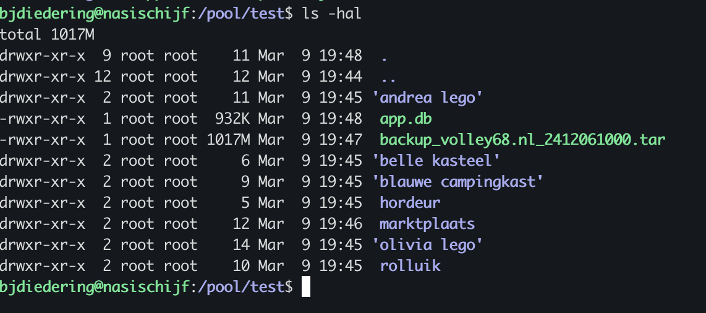

Ongeveer 1 GB aan data, dat is een mooi testje. Niet dat ik echt marktplaats foto's en een website backup uit 2024 wil backuppen, maar ik wil een relatief kleine dataset die ik prima kwijt mag raken. Ik ken mezelf.

## VSCode
Maar voordat ik ook maar iets kan gaan doen, ik word helemaal sjagrijnig van *nano* of *helix* of *vim* gebruiken in de terminal om mijn scripts te schrijven en te testen.
Gelukkig heeft VSCode een handige plugin *Remote SSH*, waarmee ik dus direct in VSCode kan werken op mijn nasischijf.
Wel even op de nasischijf `AllowTcpForwarding yes` toevoegen aan `/etc/ssh/sshd_config` en daarna de ssh service herstarten met `sudo systemctl restart ssh`.

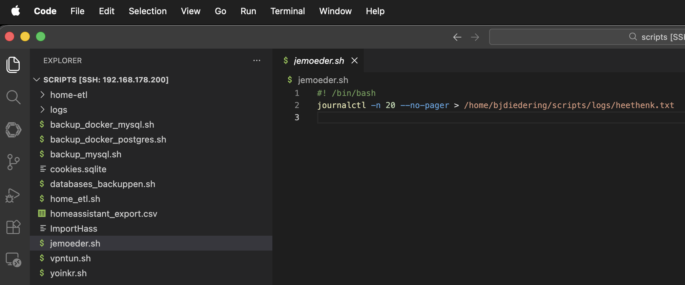

_...inderdaad, `jemoeder.sh` is een soort "ik probeer dingen uit"-script, om te kijken of dat schedulen van omv wel werkt_

Voordeel is nu ook dat ik een LLM kan gebruiken in VSCode, zoals bijvoorbeeld CodeGPT, om me te helpen met het schrijven van de scripts.

### SCP
Wat is SCP en hoe werkt het? Als ik de man pages zo lees, kopieert het commando bestanden tussen hosts met SFTP. De parameters zijn vrij eenvoudig en ik denk ik dat ik de volgende nodig heb : 
```
scp -P 23 -prTC -i "$SSH_KEY" "$SOURCE_PATH"/* "$REMOTE_USER@$REMOTE_HOST:$REMOTE_PATH"
```
Nou SCP gaat niet bijster snel. 5 volle minuten voor 1 GB data.
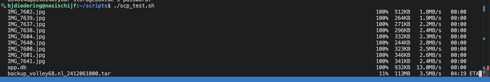

### Rsync 
Rsyncen is ook niet heel veel sneller (4 minuten voor 1 GB data) maar het is wel een stuk eleganter, want het kan ook alleen de verschillen tussen bestanden kopieren. 

```
rsync -avz --progress --stats -e "ssh -p 23 -i $SSH_KEY" "$SOURCE_PATH/" "$REMOTE_USER@$REMOTE_HOST:$REMOTE_PATH"
```

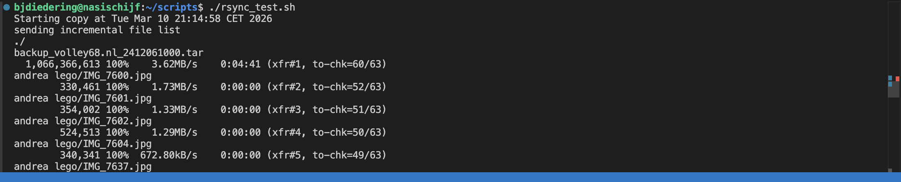

### ZFS snapshots
Hetzner heeft geen ZFS receive ondersteuning, dus dat gaat niet werken. Maar ik kan wel proberen lokaal in een tmp folder een .zfs snapshot neer te zetten en die te rsyncen naar Ultima Thule.

Mijn eerste poging resulteerde in het maken van een snapshot, de inhoud daarvan inclusief attributen en ownsership naar Ultima Thule te rsyncen.
Dat kwam neer op extra werk tmp folder maken, snapshot maken, inhoud van de snapshot daarheen clonen, dat vervolgens rsyncen. 
Dus feitelijk de vorige rsync poging :)
Maar toen dacht ik : kan ik echt niet een ZFS send stream naar Ultima Thule via een ssh cat-en naar een .zfs bestand aldaar?

```
zfs send "$dataset@$PREFIX" | ssh -p 23 -i $SSH_KEY $HETZNER_USER@$HETZNER_HOST "cat > $HETZNER_PATH/$dataset/$PREFIX.zfs"
```

Hij lijkt iets doen.... ik krijg een enorme berg met bagger over mn scherm gescrolled : 

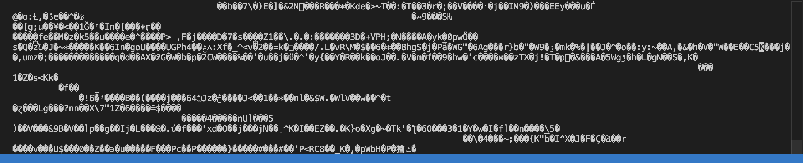

Ok na meer dan 10 minuten geef ik dit op. Deze eindeloze stream lijkt niet te werken. Maar geef toe, het idee was leuk toch? Gotta love pipes.

```
zfs send "$dataset@$PREFIX" | ssh -p 23 -i $SSH_KEY $HETZNER_USER@$HETZNER_HOST "cat > $HETZNER_PATH/$dataset/$PREFIX.zfs"
```

### Duplicati?
Nadat ik de docker-compose van [Duplicati](https://github.com/linuxserver/docker-duplicati) een klein beetje heb aangepast en toegevoegd aan mn docker-compose.tools.yml, kon ik vrij snel en eenvoudig een backup setje maken.
Beetje rondklikken in de UI en ik had al vrij snel een backup van mn dockers en scripts uit de home folder naar mn `/pool/backups` dataset.

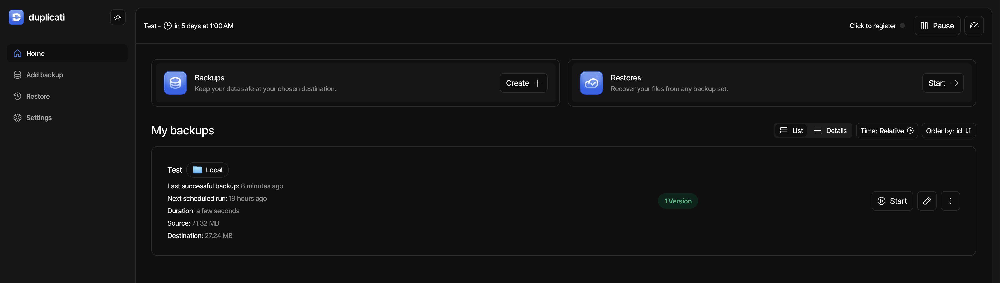

Ik ga natuurlijk de (best goeie!) [documentatie](https://docs.duplicati.com/backup-destinations/destination-overview) van Duplicati niet hier gaan herhalen, maar ik geloof wel dat ik naar Hetzner kan backuppen middels de SSH-optie.
Er wordt ook netjes een password protected enkele file gemaakt van de backup, die ik vervolgens naar Ultima Thule zou kunnen rsyncen.

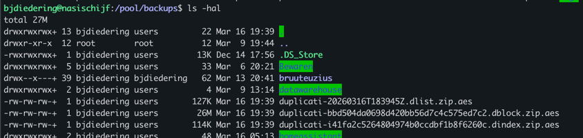

Allemaal heel erg nois, maar toch bekruipt me een beetje het gevoel dat ik dan meteen heel erg vast zit aan duplicati. Kan ik die files openen/gebruiken zonder duplicati?
Ja dat kan volgens de [docs](https://docs.duplicati.com/using-tools/encrypting-and-decrypting-files).
Ok ik had gedacht dat dit een minpunt zou zijn dat het niet kon, maar kan dus wel.
Dit is mooi voor backups van documenten enzo, maar ik denk dat het niet gaat werken voor mijn foto's en backup datasets.
Ik wil namelijk niet meerdere kopieën van een set aan foto's meerdere malen op Ultima Thule hebben staan.

## Voorlopige conclusie
Volgens mij ben ik er uit. Ik ga voor simpele rsync vanaf mijn nasischijf naar Ultima Thule.
Ik ga een script maken dat ik kan schedulen in OpenMediaVault, dat de inhoud van mijn photos en backups datasets rsynct naar Ultima Thule. 
Ik ga geen ZFS snapshots maken, want dat werkt niet met Hetzner, en ik ga ook geen duplicati gebruiken, want dat heb ik nu nog niet nodig. Voor documenten enzo. Mijn docker files kunnen in principe ook naar github of codeberg.
Ik ga ook geen SCP gebruiken, want dat is niet sneller dan rsync en het is ook niet eleganter. SCP ondersteund geen file attributes behouden.

Rsync is gewoon een solide tool die al mijn eisen voldoet en die ik ook al ken en gebruik. En heb gebruikt bij het migreren van bamischijf naar nasischijf :)
Nu weet ik niet of ik deze blogpost nog ga bijwerken met de backupscripts en mijn bevindingen na een poosje, maar deze kan alvast online.

## Update 08-03-2026
Ik heb een paar scripts gemaakt die ik kan schedulen in OpenMediaVault, die de inhoud van mijn photos en backups datasets rsynct naar Ultima Thule.

Eerst had ik de /pool/photos/bjdiedering en /pool/photos/antoinet dataset los gersynct, maar ik kwam er achter dat 
immich die niet meer bijwerkt, omdat die de foto's in een aparte folder zet, te weten `/pool/docker/immich/library/library/admin/` voor mijn immich account en `/pool/docker/immich/library/library/<guid>/` voor Antoinet.
Dus na de eerst rsync heb ik die immich library folders ingesteld voor de backup. 

In omv7 heb ik per immich user een scheduled job op andere tijdstippen, zodat ze mekaar niet in de weg kunnen zitten.
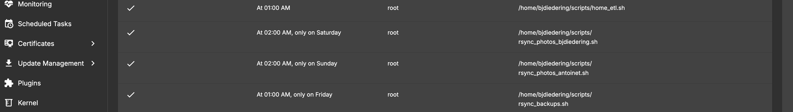

## Backups van databases
Home Assistant heeft een mysql database en ik heb zelf een Datawarehouse draaien in een postgres database container.
Voor mysql heb ik een apart script gemaakt die `mysqldump` gebruikt om een dump te maken van de database en in `/pool/backups/databases` te plaatsen.
Hetzelfde heb ik voor postgres gedaan maar dan met `pg_dump`. Deze dumps worden ook opgeslagen in `/pool/backups/databases` 

Ik check eerst of de connectie gemaakt kan worden:
```bash
echo "Testing connection to $HOST..."
if ! mysql -h "$HOST" -u "$USERNAME" -p"$PASSWORD" -e "SELECT 1;" &> /dev/null; then
    echo "Error: Cannot connect to database at $HOST with provided credentials"
    exit 1
fi
```
En dan maak ik de dump (en er omheen een if als het lukt een melding en anders dikke faal) :
```bash
mysqldump -h "$HOST" -u "$USERNAME" -p"$PASSWORD" "$DB_NAME" > "$BACKUP_FILE"; 
```

En voor postgres kijk ik of de container nog draait:
```bash
if ! docker ps --format "table {{.Names}}" | grep -q "^${CONTAINER_NAME}$"; then
    echo "Error: Container '$CONTAINER_NAME' is not running"
    exit 1
fi
```
En dan de pg_dump:
```bash
docker exec "$CONTAINER_NAME" pg_dump -U "$USER" "$DB_NAME" > "$BACKUP_FILE"; 
```

Ook gebruik ik een functie om een retentie van 3 backups te houden:
```bash
cleanup_old_backups() {
    local dir="$1"
    local db_name="$2"
    local keep_count=3
    
    file_count=$(ls -t "$dir/${db_name}_backup_"*.sql 2>/dev/null | wc -l)
    if [ "$file_count" -gt "$keep_count" ]; then
        echo "Found $file_count backups. Deleting old backups (keeping $keep_count)..."
        ls -t "$dir/${db_name}_backup_"*.sql 2>/dev/null | tail -n +$((keep_count + 1)) | xargs -r rm -f
        echo "Cleanup completed."
    fi
}
```

Om te testen had ik al 2 oudere backups van mijn datawarehouse (postgres) staan, dus na het draaien van het script 
had ik netjes 3 backups staan, waarvan de nieuwste een paar minuten oud was en er nog maar 1 van de nog oudere backups
was blijven staan: 

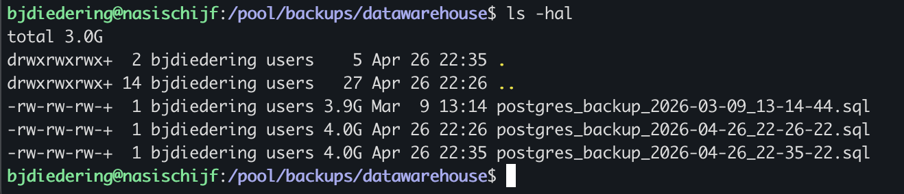

Nu kan ik het main-script in omv7 schedulen, ik denk iedere week, en dan wordt dat automatisch opgepakt door
de schedule die de `/pool/backups` dataset naar Ultima Thule rsynct :)

## Grote blij!

_Ondertussen op Ultima Thule..._

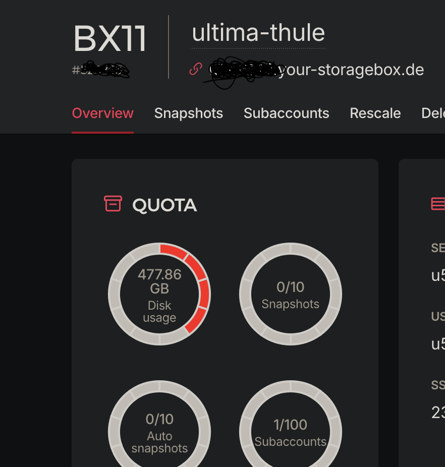
