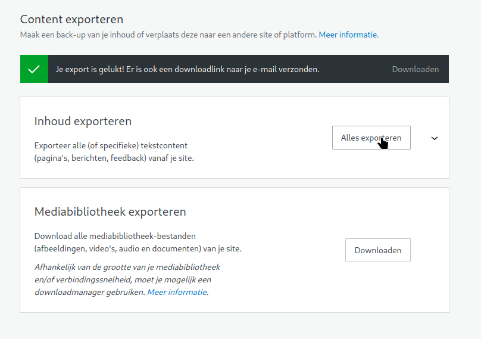
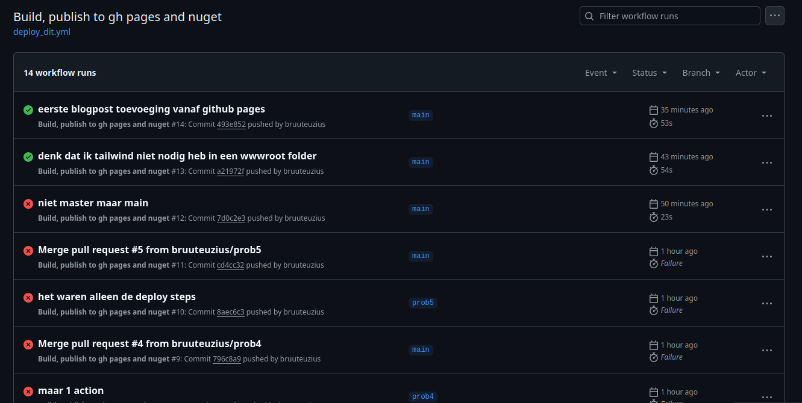

Deze blogpost is een test om te kijken of het lukt om met een commit van een md file op deze repo, een html gedeployed wordt als github page.

Allereerst heb ik een export gemaakt van mijn gratis wordpress blog met [deze](https://github.com/lonekorean/wordpress-export-to-markdown) tool
 
Toen nog wat moeten aanpassen omdat de gegenereerde `.md` bestanden niet overeen kwam met de voorbeelden van [blazorstatic](https://github.com/BlazorStatic).
Zodra de blog het lokaal goed leek te doen, heb ik met behulp van de workflow de site (na een boel retries) eindelijk live gebracht. 

Werkt best mooi, ik voeg een blogpost toe in de vorm van een markdown-file, ik commit de boel. De github-action start vervolgens de blazorstatic website,
daar komt een output folder uit. Die output folder bevat de html en media voor de blog en kopieert die naar de branch `gh-pages`. 
Github Pages is zo ingesteld dat de branch `gh-pages` als basis dient voor de inhoud van bruuteuzius.github.io :)

Daarnaast is het uiteindelijk de bedoeling om mijn gratis, maar logge wordpress-blog over te hevelen naar Github pages.
Wat ik daarvoor nog moet doen is : 
- Een manier verzinnen hoe ik de TIL pagina's (of pagina maar dan met zoekfunctie) kan overzetten.
- Sowieso maar een zoekfunctie maken
- Goodreads overzicht tonen

