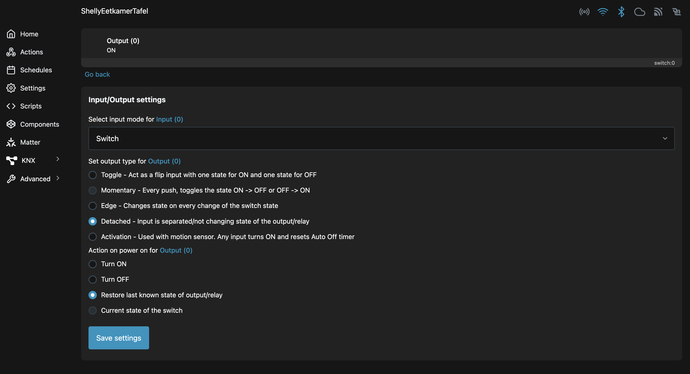
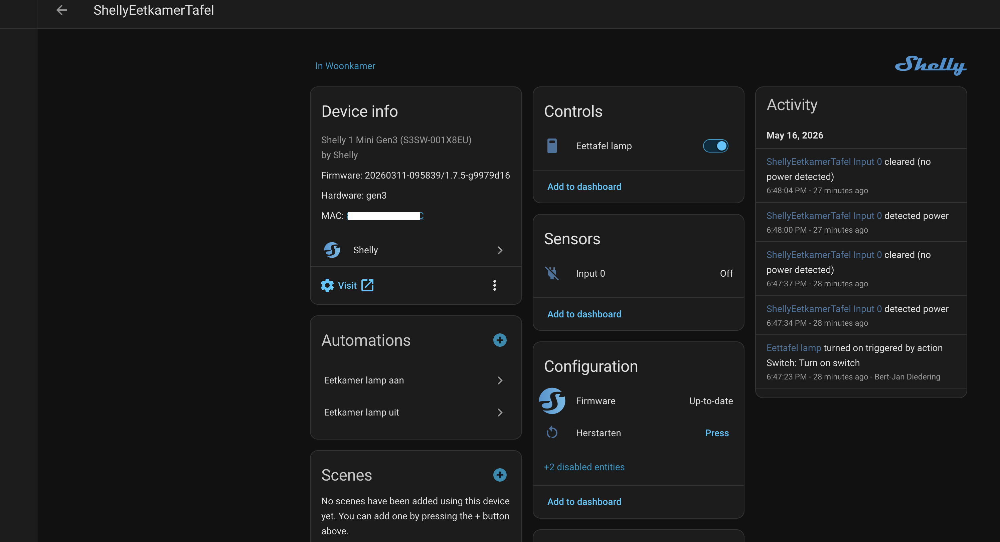
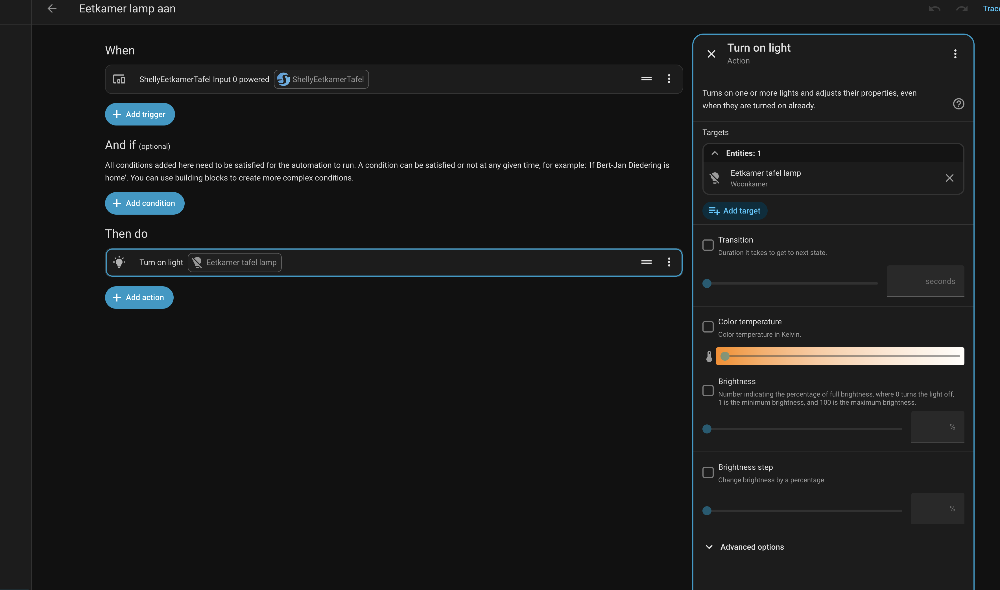
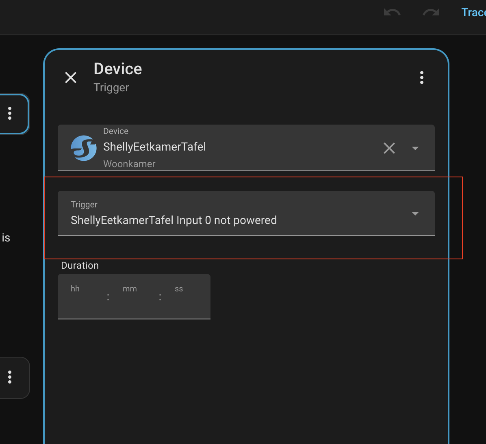

## Home assistant, shelly en ikea tradfri voor dummies (ik dus)

Zo moeilijk moet dat toch niet zijn? Die combinatie? Blijkbaar wel. Dus maar een blogpost zodat ik niet nog een keer aan dezelfde steen stoot.
Ik heb dit eerder geprobeerd te fixen. 
Het doel is: met de gewone schakelaar de lamp boven de tafel aan of uit kunnen doen, maar ook indien gewenst met de app.
En met app bedoel ik de home assistant companion app op mijn telefoon. Het schakelaar gedeelte was simpel zoals bij andere lampen; schakelaar aan, lamp aan.
Maar pas zodra de lamp ingeschakeld was kon ik bijvoorbeeld de intensiteit of kleur aanpassen. Ik heb sinds een tijdje een Home Assistant Voice assistant, maar dat is een andere blogpost.
Ik wil dus ook kunnen zeggen dat de lamp boven de tafel op 70% of 90% brightness aan moet kunnen.
In deze blogpost leg ik dit voor mezelf vast, want na een hoop gehannes is het me eindelijk gelukt.

## Stap 1 Shelly achter een schakelaar monteren.
Hoe je dat doet, wordt hier goed uitgelegd: https://www.youtube.com/watch?v=00UqosNfluw

## Stap 2 Shelly instellen.
1. Zet de input op switch
2. Zet de shelly in detached state (input en output zijn losgekoppeld)
3. Zet de output altijd aan (dit kan in Home Assistant maar ook in de Shelly web-app zelf)



## Stap 3 Home Assistant instellen
1. Zoek je shelly op in Home Assistant
2. Enable eventueel de sensor (bij mij was `Input 0` disabled!)
3. Zet onder Controls de Switch aan (kan ook in shelly web-app). Zo krijgt de tradfri altijd stroom en kun je em ook via de app aan of uit zetten. Dit punt was cruciaal voor de setup, samen met detached.
4. Maak een automation



## Maak in Home Assistant 2 automations.

### Automation 1: Schakelaar aan, lamp aan
Als ik de yaml bekijk van de automation, dan ziet dat er zo uit:

```yaml
alias: Eetkamer lamp aan
description: ""
triggers:
  - type: powered
    device_id: ab773e7936e62a176f497016b4d187a2
    entity_id: b2dedff4293c0270638dd46c40f947ee
    domain: binary_sensor
    trigger: device
conditions: []
actions:
  - action: light.turn_on
    metadata: {}
    target:
      entity_id: light.eetkamer_tafel_lamp
    data: {}
mode: single
```
Maar in de UI iets duidelijker. Let vooral op dat je bij het aanzetten van de lamp `Input 0 powered` kiest als trigger:


Vervolgens kun je bij de Lamp Aan opties nog wat settings kiezen zoals brightness:



### Automation 2: Schakelaar uit, lamp uit

Allereerst weer de bijna zelfde yaml:

```yaml
alias: Eetkamer lamp uit
description: ""
triggers:
  - type: not_powered
    device_id: ab773e7936e62a176f497016b4d187a2
    entity_id: b2dedff4293c0270638dd46c40f947ee
    domain: binary_sensor
    trigger: device
conditions: []
actions:
  - action: light.turn_off
    metadata: {}
    target:
      entity_id: light.eetkamer_tafel_lamp
    data: {}
mode: single
```

*Goed opletten!* 
Bij de automation voor het uitschakelen van de lamp, kies je `Input 0 not powered` als trigger:



## Fin
En dat was het! Lamp aan en uit via home assistant maar ook via de schakelaar, wat de WAF ten goede komt.

*Maar je had toch al een keer een blogpost over de verhuizing van Klik Aan Klik Uit naar Ikea tradfri gemaakt?*

Ja dat klopt, maar toen had ik dus de Shelly alleen nog gebruikt als doorgeefluik. 
Dus input = aan, output = aan, lamp aan.


