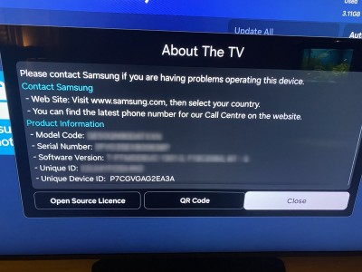
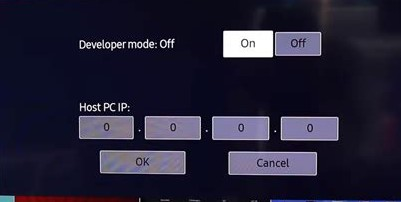
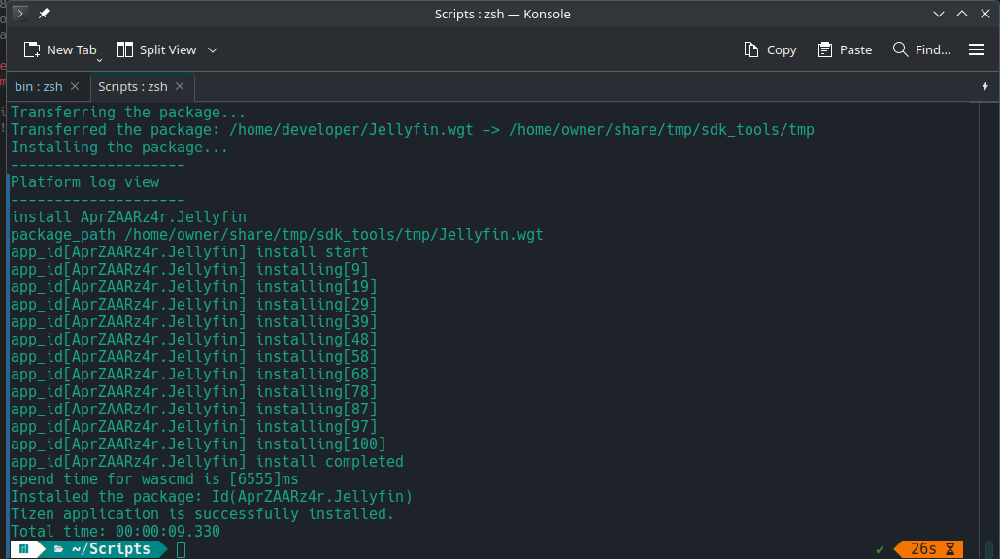

Het kostte even wat moeite maar het is gelukt, ik heb een vrij nieuwe Samsung QLED tv, nu met Jellyfin client er op :)

Tizen Studio kun je volgens de website alleen op Mac, Ubuntu en Windows installeren.
Daar dacht iemand op de interwebs anders over : https://github.com/Toxblh/tizen-studio-arch

- Stap 1 : Ik heb een Manjaro KDE plasma floplap, dus tizen op arch installeren is helemaal mooi.
- Stap 2 : De Samsung tv heeft mijn vrouw ingesteld met haar eigen Samsung-account, dus met dat account heb ik de certificaten aangemaakt volgens [deze](https://developer.samsung.com/tizen/certificate-signing/creating-certificate.html) handleiding.
- Stap 3 : Tijdens het aanmaken van de certificaten vragen ze om een DUID (Device Unique ID) ?? Die kun je vinden in de Settings van de tv en ziet er bij mij zo uit :

- Stap 4 : Zoek het IP adres van je tv op en onthoud het IP van de pc/laptop van waar je deze handleiding op volgt.
- Stap 5 : Zet je Samsung TV in developer mode. Dat kan als je naar Apps gaat, 123 knopje indrukken. Achtereenvolgens 1,2,3,4,5 en Done aanklikken met je afstandbediening.
- Stap 6 : In de volgende popup zet je de IP van je pc/laptop

- Stap 6 : Voer op je pc/laptop het volgende docker run commando uit om de nieuwste Jellyfin.wrt (nieuwste = lege quotes) te installeren met de gemaakte certificaten : 

`docker run --rm -v "/home/{username}/SamsungCertificate/{profielnaam}/author.p12":/certificates/author.p12 -v "/home/{username}/SamsungCertificate/{profielnaam}/distributor.p12":/certificates/distributor.p12 ghcr.io/georift/install-jellyfin-tizen {ip-adres-tv} Jellyfin "" '{wachtwoord}' 
`
- Stap 7 : als het goed is, ziet je output er ongeveer zo uit :

- Stap 6 : Jellyfin op je home-screen zetten, inloggen op je server met je account en klaar is kees!