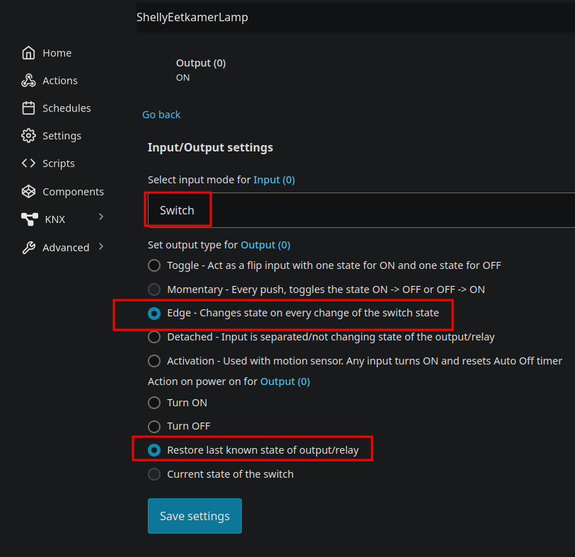
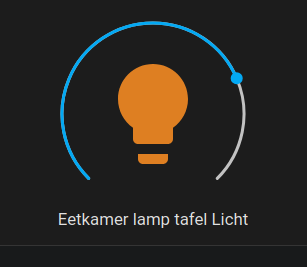

Toen we ons huis net kochtten, vonden we het wel prettig om lampen niet allemaal stuk voor stuk aan te moeten doen met een eigen schakelaar, 
dus heb ik op een aantal plaatsen in huis KlikAanKlikUit (KaKu) [stekkers](https://klikaanklikuit.nl/product/stekkerschakelaarset-3-stekkers-2300-watt/) aangeschaft en geinstalleerd. 
We hebben ook een aantal [dimmers](https://klikaanklikuit.nl/product/inbouwdimmer-voor-wandschakelaars/) van KaKu. 
Daar heb ik later een ICS2000 bij aangeschaft omdat het dan mogelijk is om met een app of op gezette tijden bepaalde lampen aan of uit te zetten. 
Ik had gehoopt dat HomeAssistant daar mee kon praten, maar helaas. Wel de oude control station, niet de nieuwe. 
Alhoewel het wel mogelijk is met een [RFlink](https://www.nodo-shop.nl/en/57-rflink) op die frequentie van KaKu (433mhz). 
KlikAanKlikUit werkt goed, maar een tijd geleden ging ineens de vitrinekast-lampen uit. 
Blijkbaar hebben we buren met minimaal 1 apparaat onder dezelfde knop... Tijd voor iets beters.

Mijn plan is dus om de lampen in en buiten het huis, die nu met KiKa geschakeld zijn, te vervangen door iets beters. 

Mijn definitie van beter is :
- Moet lokaal blijven (eigen huis/netwerk) dus geen gedonder meer met apparaten die door buren worden beinvloed.
- Er moet een afstandbediening zijn voor de lampen
- Moet op HomeAssistant aangesloten kunnen worden, zodat ik ook schema's kan instellen voor als we op vakantie zijn of de ouderwetse schakeltimers kan vervangen.
- Je kan helemaal apeshit gaan met kosten, maar het moet wel enigszins binnen de perken blijven.
- De WAF (Wife Acceptance Factor) is heel belangrijk. Geen kabels, moet werkbaar zijn, geen gedoe.

Voor zover ik heb kunnen lezen zijn er slechts een paar opties voor slimme stekkers en slimme lampen : Zigbee of Wifi (2.4ghz) of bluetooth.

## IKEA TRÅDFRI

Deze apparaten maken gebruik van Zigbee. Ik heb een lamp gekocht voor in de gang. De installatie was vrij eenvoudig :

- Plaats de slimme peer.
- Gebruik een schakelaar om deze 6x snel aan en uit te doen
- Nu de lamp in ontvang-modus is, kun je in Home Assistant de Zigbee Home Automation aanzetten en de lamp wordt gevonden (mits dichtbij genoeg maar hierover later meer).

Voordelen :

- Geen Hub van Ikea nodig, alleen de skyconnect [Zigbee dongle](https://www.home-assistant.io/connectzbt1/) die ik al had voor de temperatuur/humidity sensoren.
- Kan de felheid en kleurschakering instellen vanuit homeassistant.
- Geen dik/log apparaat op de wandcontactdoos waar de stekker in gaat.
- Niet over wifi, dus werkt ook nog als wifi eruit ligt (de raspberry pi met Home Assistant zit aan een UTP kabel).

Nadelen :
- Eigenlijk alleen dat je er een schakelaar bij nodig hebt voor achter de knop. In mijn geval is dat op meerdere plaatsen in huis een [Shelly mini](https://www.shelly.com/products/shelly-1-mini-gen3). 

## Shelly instellen
De shelly vervangt bij mij alle KaKu dimmers/switches. De shelly is wel met wifi maar kan eventueel ook met bluetooth verbonden worden. Niet zo handig dus als de wifi uitvalt. 
Een andere optie was [sonoff switch](https://sonoff.tech/product/diy-smart-switches/zbminir2/) maar ik heb goede ervaringen met Shelly (mijn domme deurbel die nu slim is).

Dit is mijn configuratie voor de lampen met schakelaar :

Hiermee kan ik met de knop aan de muur de lamp aan en uit doen en als die aan staat kan ik deze harder of zachter zetten met behulp van Home Assistant.

(_ik zie nu dat het nogal gekke tekst is, beter is alleen de naam van het device tonen_)

## Volgende stappen
Ondertussen heb ik een [bewegingsensor](https://www.smartlife-domotica.nl/beveliging-PIR-Sensoren-slimme-zigbee-bewegingssensor) aan de plafondlamp op de overloop. 
In plaats van het lullige baby-nachtlampje wil ik een warm gedimde lamp aan hebben als er snachts iemand uit moet. 
Maar dat is een automation voor een regenachtige zondagmiddag.