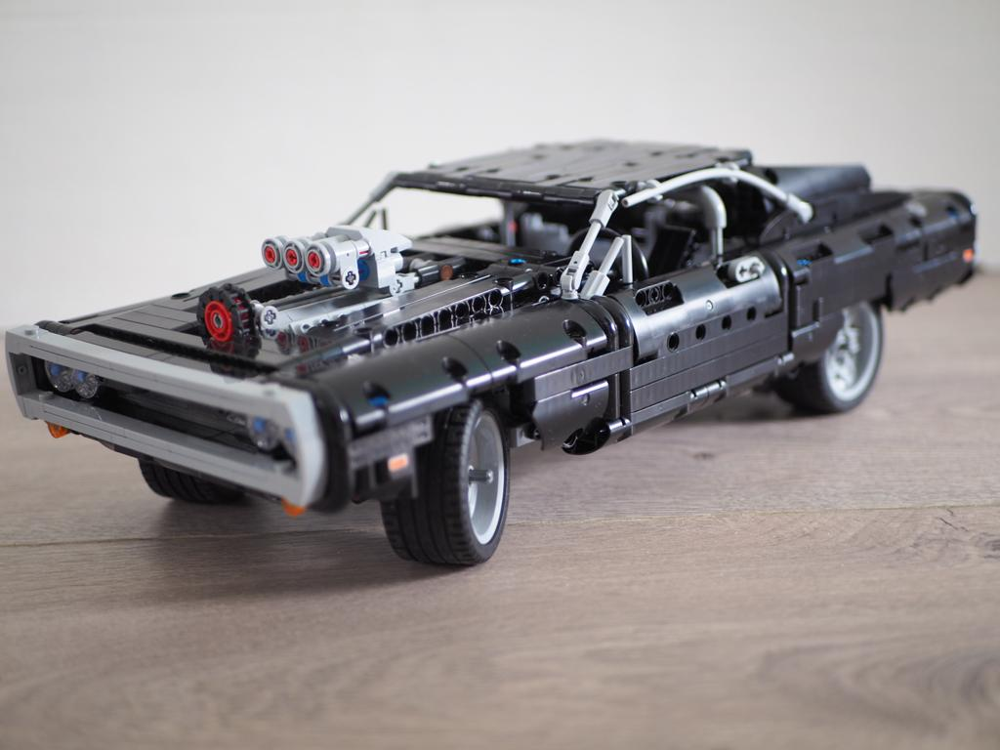

Afgelopen weekend heb ik (voor de 2e keer) mijn Dodge Charger van technisch Lego weer eens gemaakt. Had em uitgeleend aan mn schoonpa, maar hij is is weer terug. Mooi werk, brings back memories :)

Niet dat ik helemaal loesoe ga op alle Lego kopen dat ik vroeger als klein kind niet kon, maar ouderwetse Amerikaanse bolides is een droom van me. Zo kom ik iets dichter bij ;)

