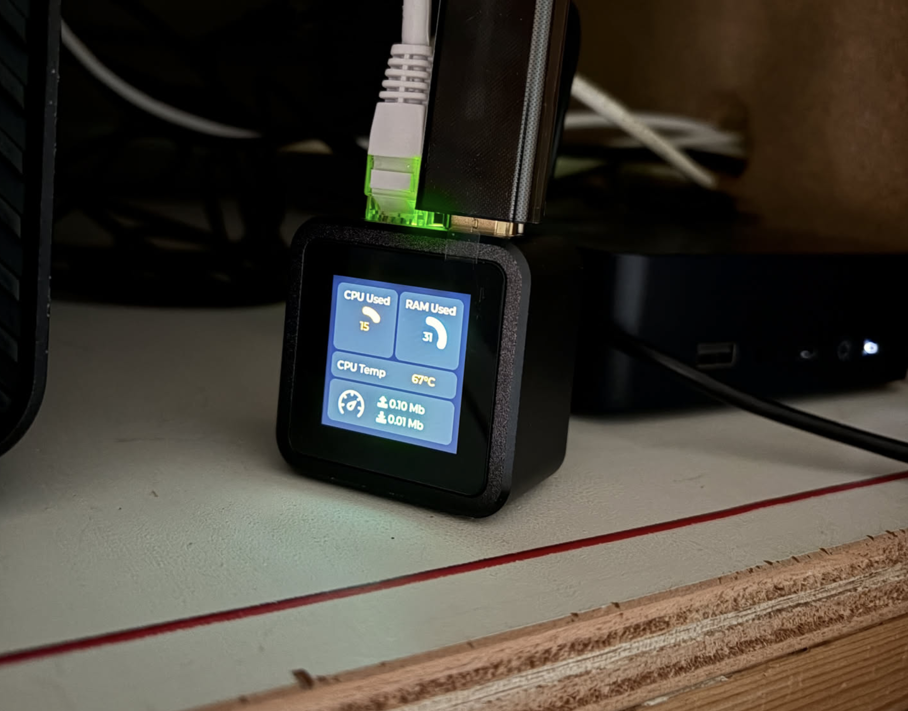
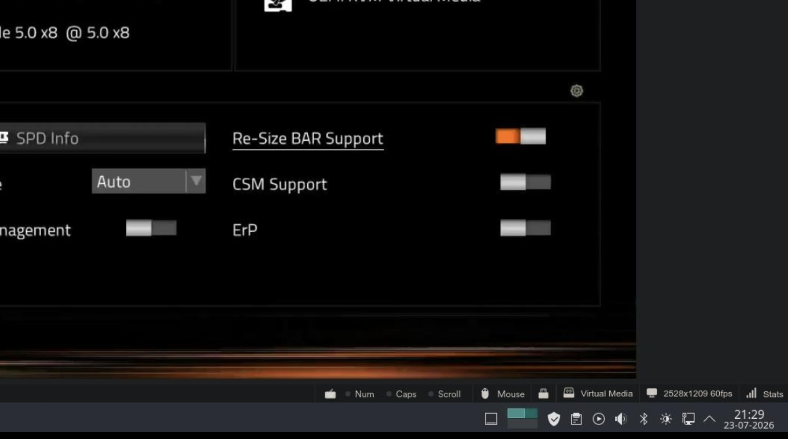
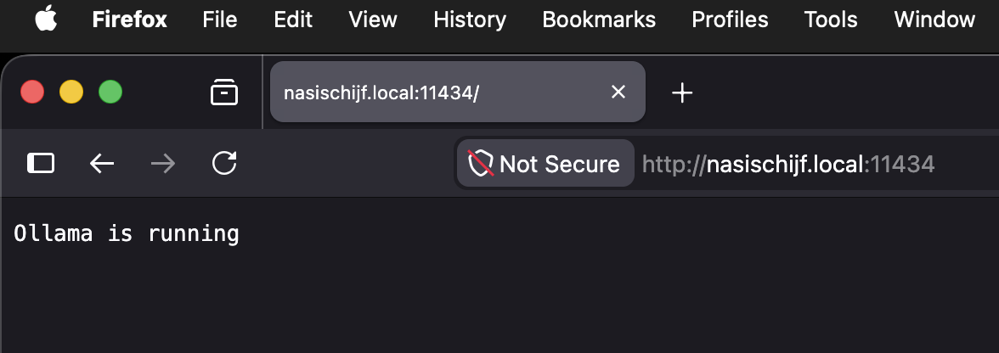
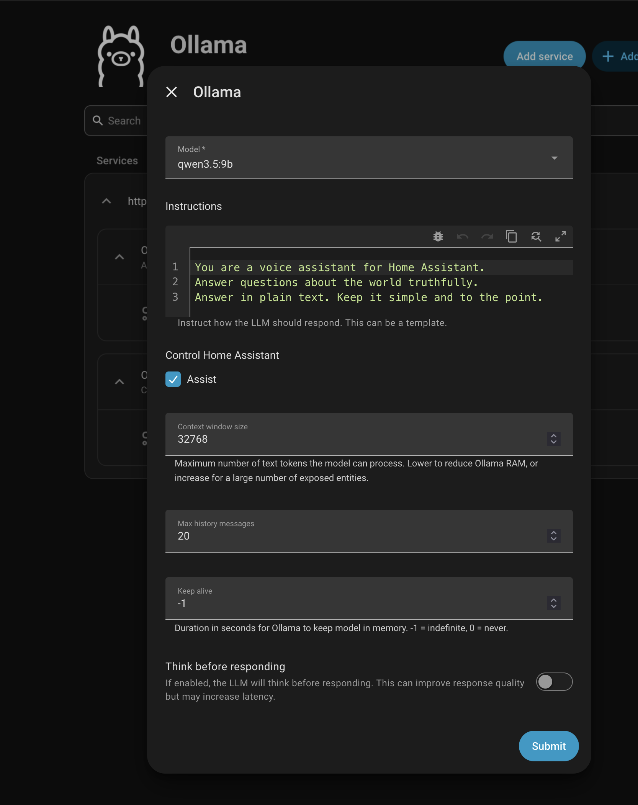

## Wat? Waarom?!
We hebben nu al een tijdje een spraak assistent in huis, in de vorm van [Home Assistant Voice Preview](https://www.home-assistant.io/voice-pe/).
Werkt als een tierelier, maar het is wel allemaal Engelstalig. Ik heb een paar automations gemaakt die getriggered worden door bepaalde zinnen.
Subobtimaal maar het werkt. De basis dingen zoals een timer zetten, lampen uit of aan doen werkt allemaal prima, maar ik wil meer.
En ik heb er ook nog geen LLM aan gekoppeld, dus ik kan er ook geen gesprekken mee voeren of vragen aan stellen.
"Okay Nabu" vind ik ook niet echt een toffe wake-word. [GUPPI](https://bobiverse.fandom.com/wiki/GUPPI) is geen optie want te nerdy. "Hey Jarvis" heeft iedereen al en ik heb nooit Doctor Who gekeken.

Mijn wens is: Het huis smart-home opdrachten geven in het Twents, of in ieder geval in het Nederlands.

Wat moet er gebeuren?
- Een LLM draaien op een server in huis, zodat ik niet afhankelijk ben van externe API's.
- Waarschijnlijk Ollama of llama.cpp gebruiken om aan Home Assistant te koppelen.
- Een wake-word instellen dat ik leuk vind.
- Een model vinden dat goed Nederlands kan, enigszins snel is en in de VRAM van de GPU past.
- Dat model aanpassen en/of Twents voeren?

## LLM draaien op een server in huis

### De hardware

#### De server
Ik heb al een nasischijf (zie eerder [blog](blog/project-bamischijf-2)). Dat was een Jonsbo N2, maar ik had me bedacht dat daar geen normale videokaart
in kan. Dan zou ik een low-profile kaart nodig hebben. Dus ik heb een Jonsbo N3 gekocht en de N2 verkocht aan een enthousiaste
zelfbouwer. De N3 heeft ruimte voor 2 PCI kaarten met normaal formaat. Of een videokaart die 2 slotplates in beslag neemt :)

#### De videokaart
Na lang zoeken heb ik uiteindelijk een [Intel Arc B50](https://tweakers.net/pricewatch/2283478/intel-arc-pro-b50.html) gekocht toen die redelijk mee viel
qua prijs. Alles overzetten was een gedoe. Het leek wel een open hart operatie : 


Maar uiteindelijk draait alles weer. Het enige probleem is: de kaart krijg ik nog niet aan de praat.
De drivers zijn nog niet helemaal up-to-date met debian 13 en ik moet in de BIOS nog BAR aanzetten.
Daarvoor heb ik de NAS een keer afgesloten, mee naar zolder genomen (waar monitor, toetsenbord en muis staan)
en geprobeerd de BIOS te benaderen. Maar dat lukte niet omdat de Intel Arc nu natuurlijk de main GPU is, maar ik heb geen
hdmi naar mini-dp kabel. En ik heb eerlijk gezegd ook geen zin meer om de boel steeds compleet af te sluiten en naar boven 
te sjouwen als ik een aanpassing in de BIOS moet doen. Dus ik heb de NAS maar weer teruggezet boven de meterkast.

#### Een KVM
Na wat zoekwerk heb ik dit apparaatje gekocht: [Luckfox pico kvm](https://www.amazon.nl/dp/B0FRFWR5PM?ref_=pe_151259371_1319653121_t_fed_asin_title)



Nu kan ik eindelijk bij de BIOS. Ik heb de BAR gezet en een reboot gedaan. Op afstand! Hoe vet.



### De software
#### Docker
Ik heb ervoor gekozen om ollama in een docker container te draaien. Mijn setup is geen fancy kubernetes oid, maar gewoon een paar docker compose files in de home folder. De docker-data staat in een filesystem.

```yaml
services:
  ollama:
    image: ollama/ollama
    container_name: ollama
    restart: unless-stopped
    ports:
      - "11434:11434"
    volumes:
      - /pool/models:/root/.ollama
    environment:
      - OLLAMA_INTEL_GPU=ON
      - OLLAMA_CONTEXT_LENGTH=65536
      - ONEAPI_DEVICE_SELECTOR=offed:gpu
      - LD_LIBRARY_PATH=/opt/intel/oneapi/tcm/1.5/lib:/opt/intel/oneapi/umf/1.1/lib:/opt/intel/oneapi/tcm/1.5/env/../lib:/opt/intel/oneapi/tbb/2023.1/env/../lib/intel64/gcc4.8:/opt/intel/oneapi/mkl/2026.1/lib:/opt/intel/oneapi/debugger/2026.1/opt/debugger/lib:/opt/intel/oneapi/compiler/2026.1/opt/compiler/lib:/usr/lib/x86_64-linux-gnu
      - OLLAMA_HOST=0.0.0.0:11434
    devices:
      - /dev/dri:/dev/dri 
    network_mode: "host"
```

Dat lijpe library path is om de drivers van de openapi GPU te kunnen gebruiken. 

Een `docker compose up` en in de container een model pullen en klaar is kees : `docker exec -it ollama ollama run qwen3.5`

Check of Ollama op de nasischijf draait (misschien nog poort 11434 open zetten in `ufw`) :



## Ollama en home assistant
Peuleschil, gewoon  installeren en een model kiezen. Daarna in Home Assistant Settings, Voice Assistants, 1tje toevoegen en Ollama als conversation agent kiezen. Mijn collega heeft daar een mooie [blogpost](https://nickvanraaij.com/blog/ai-and-home-assistant) voor geschreven.
Ik dacht ik doe ook qwen2.5:3b, dan heb ik nog ruimte over en die is lekker snel op mijn GPU. Het resultaat is best ok! Ik had net het model geladen en stel mijn testvraag : 
"Why is the sky blue?" Het duurde in totaal 4 seconden voordat ik een heel  terugkreeg van Nabu... Niet slecht toch? Maar jeetje wat een tekst. En Engels. Nouwja de basis is er. 

#### Kleine sidestep
Als je zoals ik een server met een moederbord hebt met een videokaart (dus een GPU) dan kun je eventueel STT en TTS versnellen. Voor piper kun je een App (docker) op je raspberry pi installeren, maar ik heb hiervoor een docker-compose op mijn nasischijf gemaakt en opgespind : 

```yaml
services:
  wyoming-piper-igpu:
    container_name: wyoming-piper-igpu
    image: rhasspy/wyoming-piper
    command: --voice en_US-hfc_female-medium
    volumes:
      - ${DOCKER}/piper-data:/data
    ports:
      - "10200:10200"
    restart: unless-stopped
```

Whisper in dezelfde docker-compose lukte me niet, omdat ik geen geschikte whisper docker compose kon vinden dus heb ik zelf maar een docker image geknutseld en die opgespinned : 

```yaml
services:
  whisper-cpp:
    container_name: whisper-cpp-igpu
    build:
      context: ./whisper-cpp
      args:
        - WHISPER_CPP_VERSION=1.7.4
        - BUILD_FROM=intel/oneapi:2025.0.1-0-devel-ubuntu24.04
    restart: unless-stopped
    depends_on:
      model-download:
        condition: service_completed_successfully
    # Change user to the one that will run the container
    user: 1000:100
    group_add:
      # Change this number to match your "render" host group id
      # You can get the id number by running: getent group render
      - "105"
    security_opt:
      - no-new-privileges:true
    volumes:
      - type: bind
      # Please change /path/to/models to a real directory the user the service is running as can read and write to
      # Make sure to do the same for model-download service too
        source: /pool/docker/whisper-models
        target: /models
    networks:
      whisper: {}
    hostname: whispercpp
    devices:
      - /dev/dri:/dev/dri
    environment:
      - SYCL_CACHE_PERSISTENT=1
      - SYCL_CACHE_DIR=/models/sycl_cache
      - SYCL_DEVICE_ALLOWLIST=BackendName:level_zero
    command: build/bin/whisper-server -l ${WHISPER_LANG} -bs ${WHISPER_BEAM_SIZE} -m /models/ggml-${WHISPER_MODEL}.bin --host 0.0.0.0 --port 8910 --suppress-nst --prompt "${WHISPER_PROMPT}"
  wyoming-api:
    container_name: wyoming-api-igpu
    build:
      context: ./wyoming-api
      args:
        - BUILD_FROM=debian:bookworm-slim
    restart: unless-stopped
    depends_on:
      whisper-cpp:
        condition: service_started
    security_opt:
      - no-new-privileges:true
    # Change user to the one that will run the container
    user: 1000:100
    networks:
      whisper: {}
    ports:
      - 7891:7891
    command: script/run --uri tcp://0.0.0.0:7891 --api http://whispercpp:8910/inference
  model-download:
    security_opt:
      - no-new-privileges:true
    user: 1000:100
    build:
      context: ./model-download
    volumes:
      - type: bind
      # Please change /path/to/models to a real directory the user the service is running as can read and write to
      # Make sure to do the same for whisper-cpp service too
        source: /pool/docker/whisper-models
        target: /models
    restart: no
    networks:
      whisper: {}
    environment:
      - MODEL=${WHISPER_MODEL}
networks:
  whisper: {}
```

Dit scheelt (uit ervaring) maar 1 seconde tegenover de Wyoming protocollen als App (docker container) op de Raspberry Pi zelf in Home Assistant installeert.

Voor nu is dit eerst even genoeg geblogged. Later pas ik deze post aan voor de volgende onderwerpen, ik ga nu eerst een test-periode in.

## Een ander wake-word

## Nederlands model zoeken/aanpassen

## Model aanpassen voor Twents