Volgens mij heeft mijn vrouw de smaak te pakken dat ik dingen van hout maak want tegelijk met het aanschaffen voor het hout voor de tuinbank, heb ik ook hout opgehaald voor een rek voor aan de muur, waar dan plantenpotten op kunnen staan. Ik denk dat de juiste benaming "plantenrek" is, maar pin me er niet op vast.

Zelf had ik een vrij simpel design in gedachten :

Maar mijn vrouw zou mijn vrouw niet zijn als ze iets sierlijks, iets landelijks wilde hebben in dezelfde kleur als de bloembak en de tuinbank.

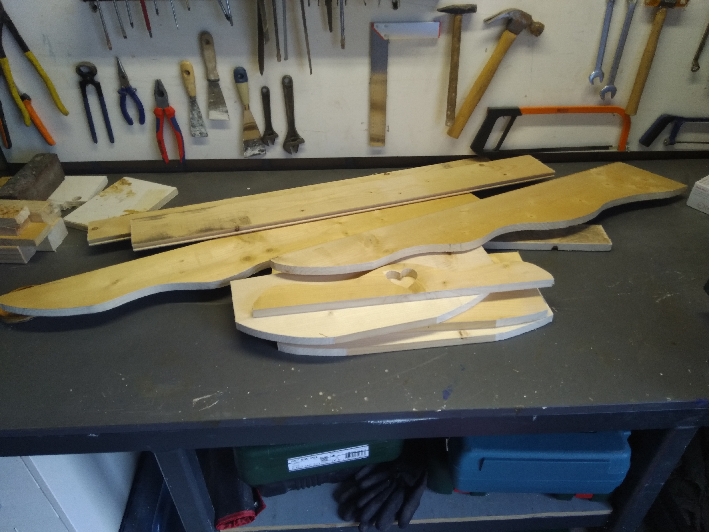

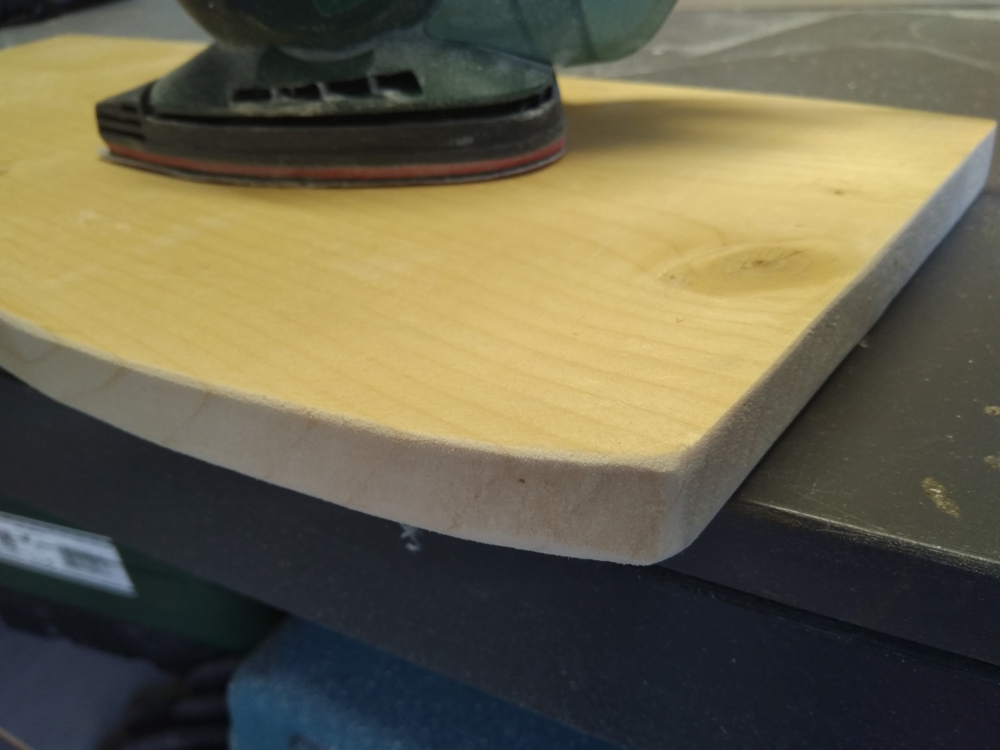

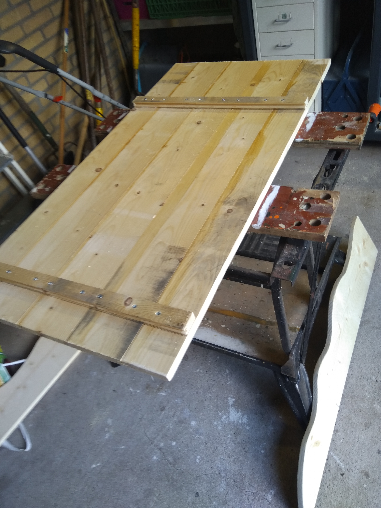

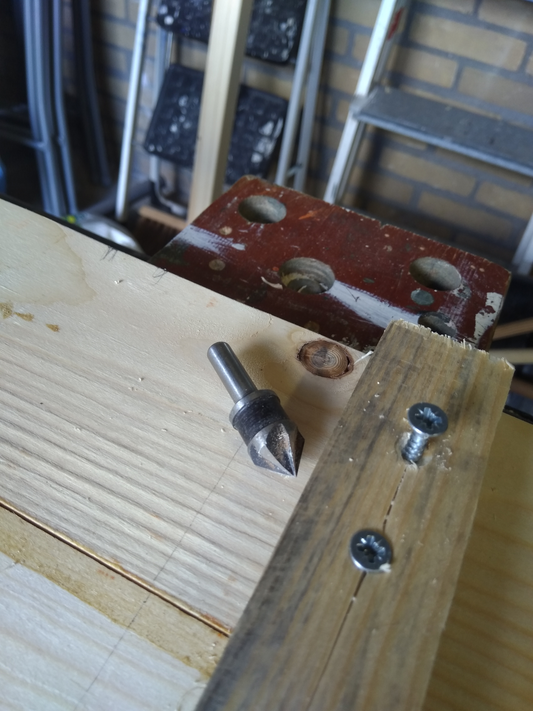

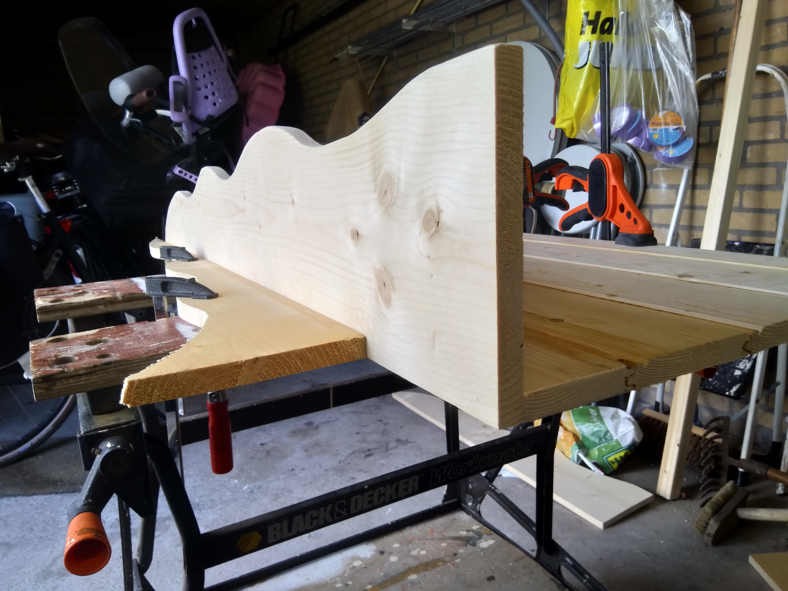

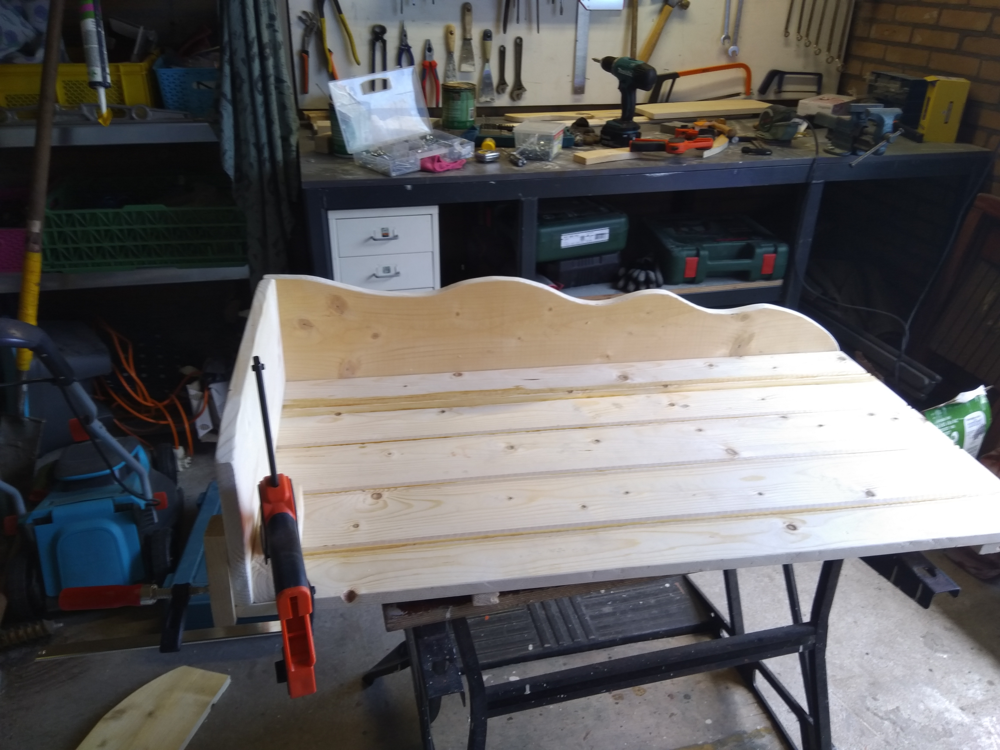

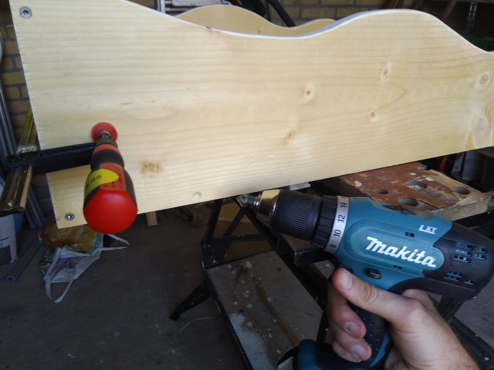

De schraaldelen (schrootjes) was een idee van mijn zwager, geeft een leuk effect al zeg ik het zelf! Voor de montage heb ik schroeven van 50x4 gebruikt. Gelukkig zit er een bitje bij want zulke miniscule bitjes had ik nog niet :) Omdat het vuren is, splijt dat makkelijk als je er iets te lomp een schroef in drukt. Dat is te zien bij de foto links onder.

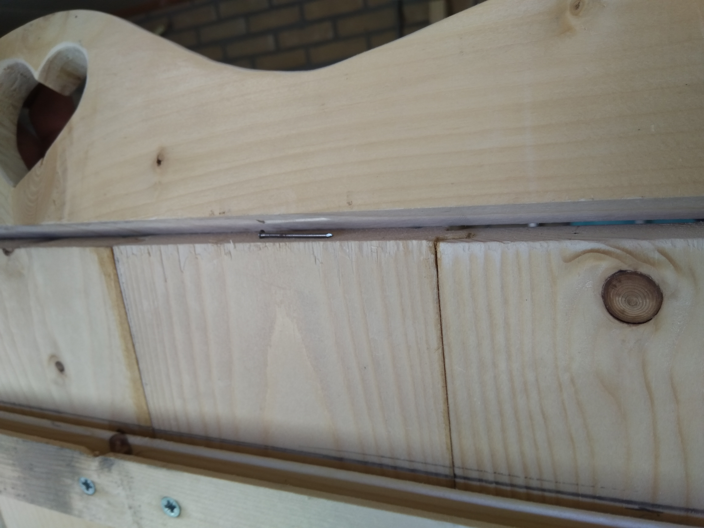

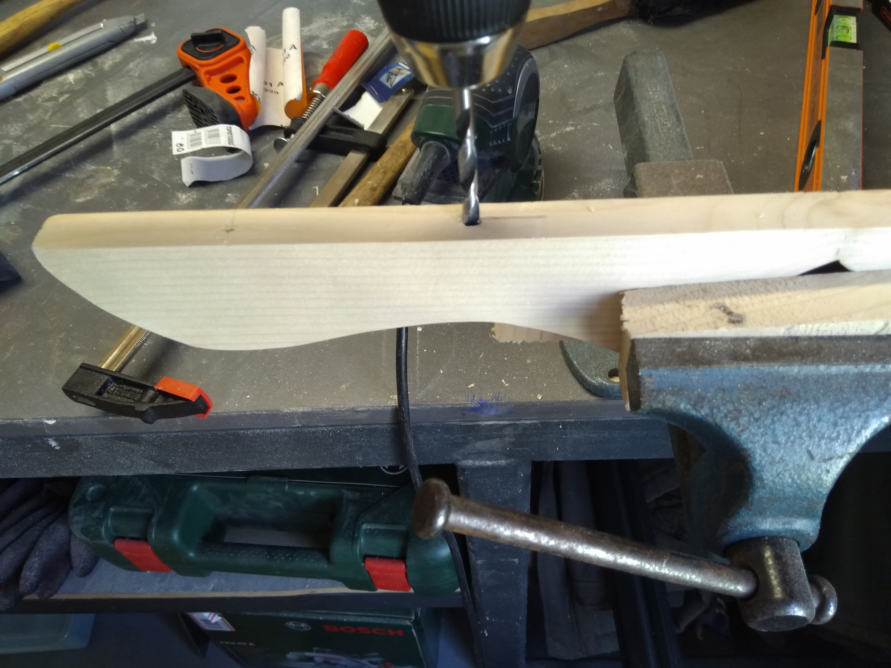

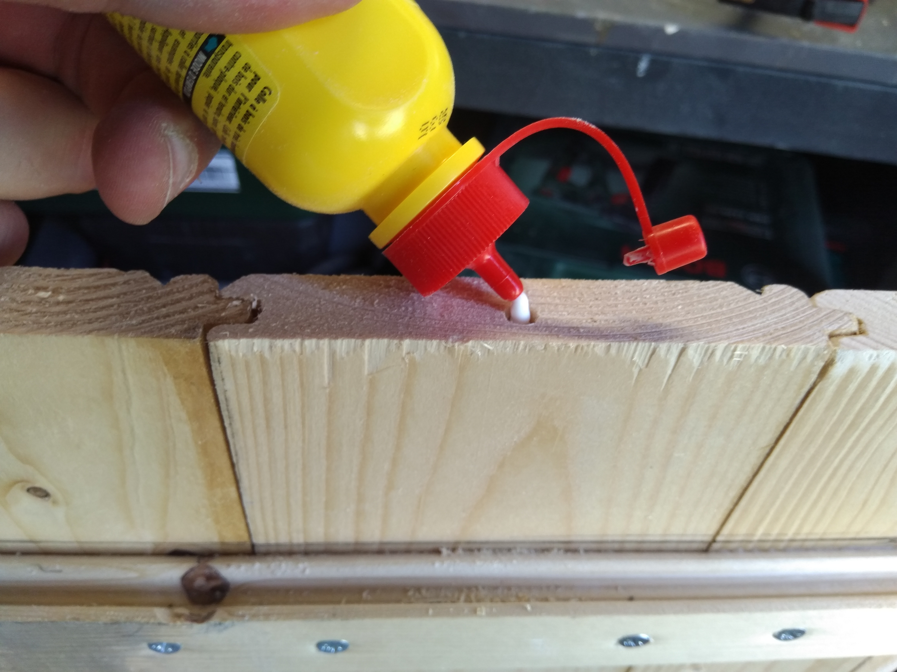

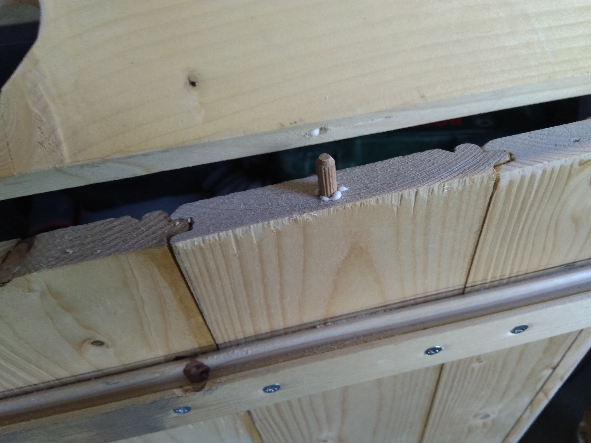

Bovenop het plantenrek moest natuurlijk ook iets sierlijks komen om het af te werken. Ik heb eerst met een speedboor 2 gaten gezaagd en daarna het hartje verder met de decoupeerzaag gemaakt. Vervolgens leg je kleine spijkertjes op de plek dat het gat voor deuvels moet komen en druk je het hout goed aan. Daarna boren, beetje houtlijm er tussen en monteren.

- 
    
- 
    
- 
    

Tot slot heb ik er voor gekozen om voor het plantenrek dezelfde beits te gebruiken als de tuinbank en plantenbak.
