## Project bamischijf 2.0
Mijn huidige NAS heet bamischijf en is een DS920+ van Synology. Maar de 4x4TB in SHR2 zit nu op 80% volheid en na
[deze](https://www.tomshardware.com/pc-components/nas/synology-requires-self-branded-drives-for-some-consumer-nas-systems-drops-full-functionality-and-support-for-third-party-hdds) 
stunt van Synology wil ik eigenlijk geen Synology meer maar mn eigen zelfbouw NAS.
De keuze is gevallen op een Jonsbo N2. Hier heb ik 3x16TB HDD's in, een Intel i5 13500 met 14 cores, 64GB aan geheugen en een 500GB SSD voor het OS.
Het gigabyte moederbord heeft 4 SATA stekkers wat voor nu genoeg is.

> **_Dikke tip :_**
> De fan die bij de jonsbo zit, niet aansluiten onder de molex stekkers maar op het moederbord, zodat je de snelheid kan reguleren.

## Het plan
Zoals [Jim Salter](https://jrs-s.net/2025/08/11/rustdesk-server-on-ubuntu-22-04/) het mooi zegt : _As usual, I’m self-documenting a project while I work on it_ Dat spreekt me wel enorm aan want ik ben niet zo goed in plannen. Ik doe liever.
Kortom, er is geen plan. Ik kan wel een lijstje maken met wat ik nu aan apps, scripts en functionaliteiten op de Synology heb en wat ik straks op 
mijn nieuwe server wil, of nodig ga hebben.

- DSM 7 als frontend om in te klikken
- SHR2 (een soort RAID5)
- Shared Folders (zoals backups, downloads, web, docker, homes)
- file services (AFP voor Mac, NFS, SMB)
- home dirs met daarin o.a. foto's
- apps (zoals synology drive client)
- docker containers
- media en backups
- scripts in de task scheduler
- firewall
- notificatie mogelijkheden
- verbinding met UPS
- fan control
- server monitoring

## Stap 1 : De server installeren
Boven onze voorraadkast in de gang, had ik nog een loze ruimte. Deze ruimte is naast de meterkast, dus het leek me een mooie plek
voor mijn servers. De Frigate-server (een Beelink EQ14) staat er al, mijn nasischijf kan er prima naast :

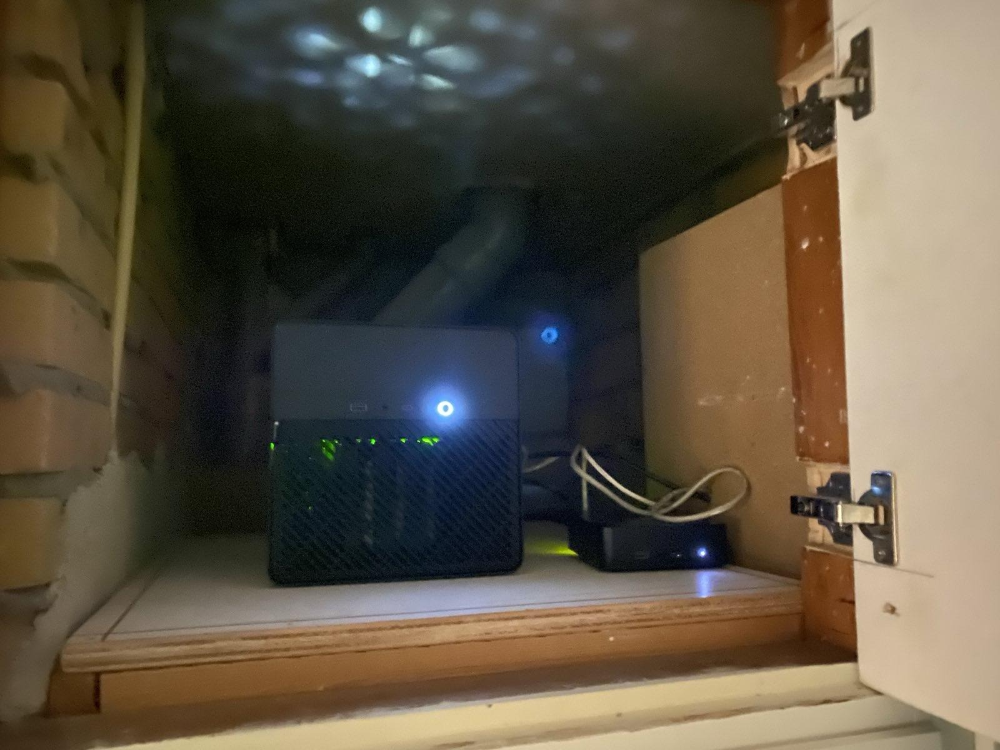
_Vet he? Ik heb die houten plaat weggeschroeft, kit er omheen weggesneden en een paar keukenkastjes-scharnieren gebruikt, om een deurtje te maken. Nu valt het niet op dat er iets achter zit, en als ik er bij moet dan kan dat :)_

OpenMediaVault gaat mijn frontend worden ipv DSM 7. Het is ook mogelijk om DSM op een niet-Synology te installeren, maar dat voelt als cheaten en lijkt me niet wat.

> _21-09-2025 Zie struikelblok 1 verderop. Installeer dus debian 12!_

En OMV heeft debian nodig dus tsja. Ondertussen heb ik een usb stick met Debian 12 gemaakt. Ik gebruik op mijn laptop KDE Iso Writer. Die vraagt om een checksum.
Een checksum van je iso pakken doe je zo : 
```
sha256sum debian12.iso
```
Het resultaat daarvan plak je in de tool en hoppaaa usb stickie bakken. Dat is cheaten want je moet op de website de sha vinden, maar dat lukte dus niet :)

### SSH
Nu de server een debian install heeft, moet ik nog een ssh server draaien. 
```
sudo apt install openssh-server
```
en daarna starten met `sudo systemctl start ssh` en dan de service enablen zodat ie na een herstart `sudo systemctl enable ssh`.
Draait de ssh service? `sudo systemctl status ssh` Dan kan de server in de kast boven het voorraadhok.
Het enige dat de server nodig heeft is stroom en een UTP kabeltje. 

### Vast ip adres
Eerst maar eens een update doen. 
```
sudo apt update
```
bjdiedering is not in the sudoers file. Okeeeeej. Nouwja ook wel fijn dat niet alles aan staat en ik zelf ook wat moet doen.
`bjdiedering ALL=(ALL:ALL) ALL` toevoegen aan `/etc/sudoers` en klaar. 

```
sudo apt install net-tools dnsutils iproute2 nano
```
En dan een static ip adres in `/etc/network/interfaces` (eerst backup maken!)
```
auto eno1
allow-hotplug eno1
iface eno1 inet static
    address 192.168.178.200
    netmask 255.255.255.0
    gateway 192.168.178.1
    dns-nameservers 8.8.8.8 8.8.4.4
```
Misschien nog een keer niet-google dns-en, maar soit. 
Daar netwerk restarten:
```
sudo systemctl restart networking
```
### Firewall
Nu wil ik een firewall. Ik heb ergens gelezen dat OpenMediaVault ufw ondersteund, maar ik heb ook gelezen dat die niet lief
samen speelt met docker. Maar dat lijkt me een later zorg. 
Eerst maar eens `sudo apt install ufw`. Dan een backup maken van de basis met `sudo cp /etc/default/ufw /etc/default/ufw.backup` en `sudo cp -r /etc/ufw /etc/ufw.backup`
Ik wil nog wel kunnen ssh-en dus `sudo ufw add ssh` 
En een paar basis rules : 
```
sudo ufw default deny incoming
sudo ufw default allow outgoing
sudo ufw default deny forward
```

Aanzetten en we zijn safe `sudo ufw enable`

### Monitoring
Eerst maar eens snel de temps monitoren. 
```
sudo apt install lm-sensors
```
Daarna de sensors vragenlijst starten met `sudo sensors-detect` en daarna kun je met `sensors` zien wat o.a. de temps zijn.

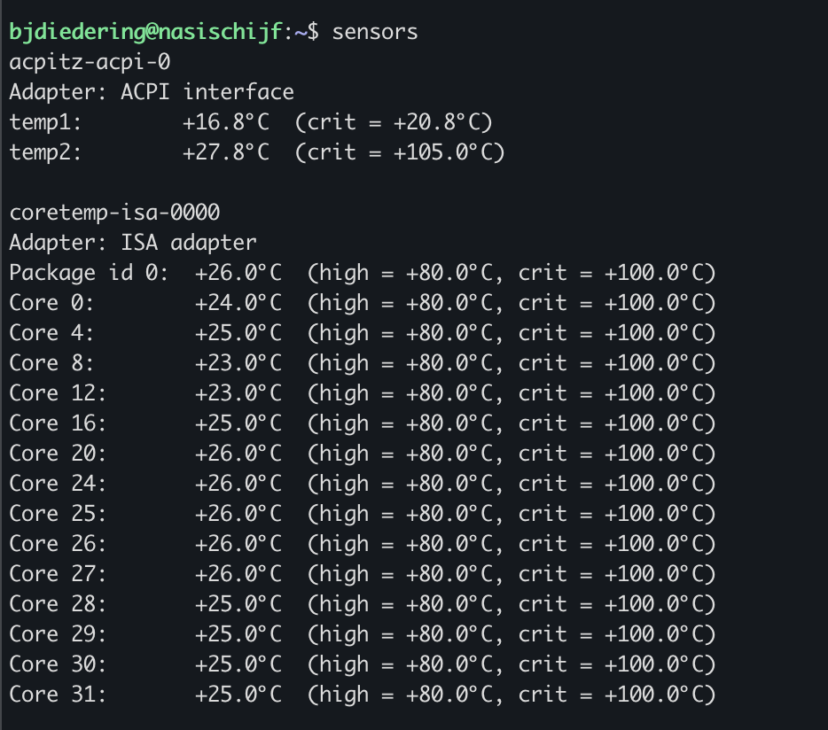

De nasischijf staat al een tijdje in de kast dus dit zijn goeie temps voor een ding dat niet zoveel doet :)

Maar om nu iedere keer te ssh-en en kijken wat o.a. de temperatuur is van alles, ga ik toch liever naar mn grafana dashboard.
Dus we gaan node-exporter installeren :
```
sudo apt install prometheus-node-exporter
```
Dan nog de node-exporter poort 9100 toevoegen aan ufw en klaar is Bert `sudo ufw allow 9100/tcp`

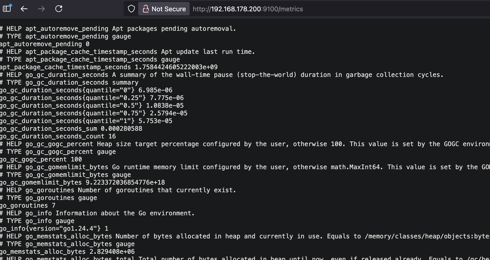

Hierna heb ik de prometheus.yml op mn oude NAS (bamischijf 1.0) aangepast, `docker restart prometheus` en ik kan de metric toevoegen:
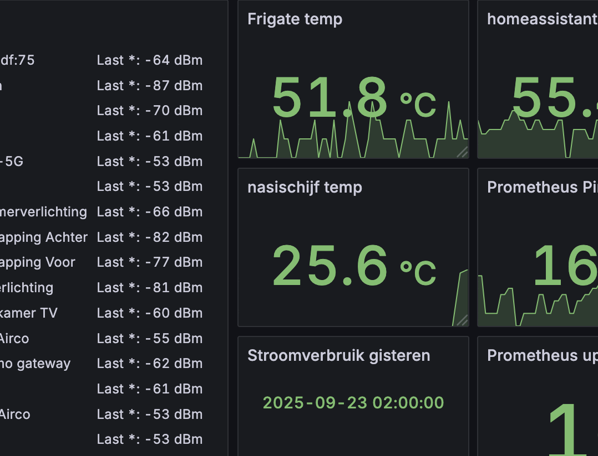

Misschien is 25,6 graden niet helemaal zuiver de gemiddelde temperatuur, maar alleszins de temp van teminste 1 CPU core. Mooi woord : alleszins.

### Struikelblok 1
Ik dacht : ik installeer debian 13 want die is de nieuwste. Kom ik er net op dit punt achter dat OpenMediaVault nog niet wordt ondersteund
door [debian 13](https://docs.openmediavault.org/en/latest/releases.html)... Dus ik ga denk ik maar weer opnieuw een installatie doen, 
maar dan met OpenMediaVault 7 met debian12. Zodra OpenMediaVault 8 klaar is, kan ik upgraden naar debian13.

### OpenMediaVault
De installatiehandleiding kan ik niet veel meer van maken dan wat [hier](https://docs.openmediavault.org/en/latest/installation/on_debian.html) staat.
Niet vergeten om na de installatie van OMW mezelf toe te voegen als iemand die mag ssh-en: `sudo usermod -a -G _ssh bjdiedering`
Er staat namelijk duidelijk in de installatie handleiding dat door het installeren van OMV de user die tijdens het installeren
van debian is aangemaakt, niet perse kan ssh-en. 

Na een reboot, naar http://192.168.178.200 en we krijgen een mooi loginscherm te zien : 

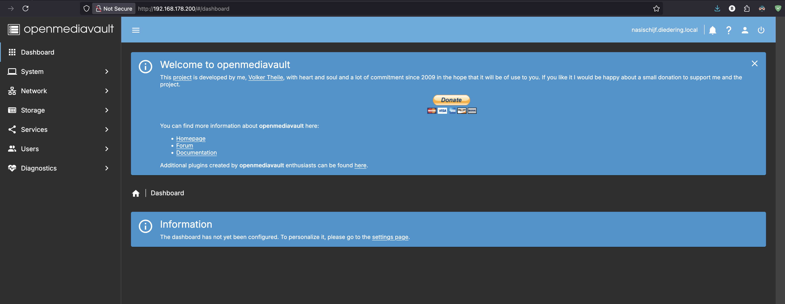

Let the fun begin! Voor nu deze post committen naar mn github repo, zodat de blogpost wordt bijgewerkt.

#### Plugins
Laten we beginnen met DNS instellen in de GUI want anders kan ik niet wgetten vanaf een terminal. Klik op Netwerk, Interfaces,
klik op je netwerk-kaart (bij mij was dat eno1), scroll naar beneden en vul een DNS in. Bijvoorbeeld 8.8.8.8 (van google) of 1.1.1.1 (cloudflare)
Nu kun je in je terminal : 
```
wget -O - https://github.com/OpenMediaVault-Plugin-Developers/packages/raw/master/install | bash
```
Als je DNS niet instelt, krijg je deze foutmelding :
`Resolving github.com (github.com)... failed: Temporary failure in name resolution.
wget: unable to resolve host address ‘github.com’`

#### ZFS
Nadat omv-extras is geinstalleerd: refresh de pagina en zoek onder Plugins naar de plugin **openmediavault-kernel** en installeer deze. 
De proxmox kernel is maximaal stabiel en handig als je stabiele ZFS wil draaien heb ik ergens gelezen.
Ga nu (na de page refresh) naar System, Kernel, en kies uit de dropdown de nieuwste proxmox kernel :
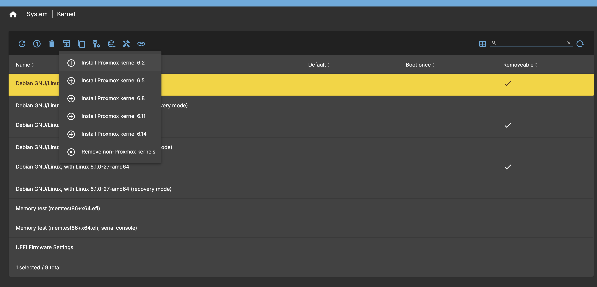
Kies een proxmox kernel en zet die als boot. De proxmox kernels eindigen met -pve 

Installeer nu **openmediavault-zfs**. Refresh de pagina weer en ga via Storage naar zfs. Nu moet je dus een naam gaan kiezen.
Iedereen op de interwebs kiest voor "tank". Maar ik dacht eerst aan "deadpool". Maar dat is luguber. Terwijl het misschien wel goed is. 
Deadpool kan iig niet dood.... Kies een naam, kies het type van de pool (ik heb RAID-Z1), kies de disks waar je de pool mee wil maken.
Ik heb 3 disks van 16TB. Vanwege RAID-Z1 krijg heb ik 1 disk voor pariteit en ongeveer 2 disks voor data. 
Technisch gezien zou de totale capaciteit 32 TB moeten zijn, maar de 29TB snap ik ook wel. Ik heb ashift op `12` gezet en compression op `lz4`.
Nu de pool bestaat kan ik een paar filesystems toevoegen zoals backups.

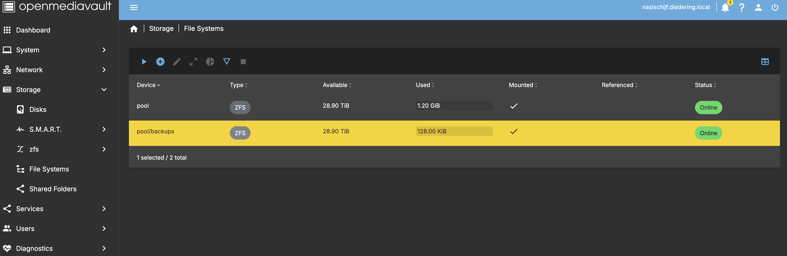

Ik ben er achter gekomen dat als je bijvoorbeeld een NFS of SMB share wil maken, dat je daarvoor eerst een Shared Folder moet maken.
De filesystems die ik heb gemaakt, ga ik ook shared folders voor maken. Als je van het filesystem `/pool/backups` een shared folder wil maken,
is het aan te raden om het relative path **niet** `/backups/` te maken, maar `/` want anders krijg je `/pool/backups/backups` als shared folder.

Tijd om een kopieer-test uit te voeren.
Laat ik eens een SQL Server backup rsync-en van bamischijf naar de nasischijf. Maar dan ben ik niet zo heel erg blij met de overdrachtsnelheid...
Ook al gebruik ik compressie en staan de NASen dicht bij elkaar en zit er een gigabit switch tussen... hier gaat iets niet goed: 

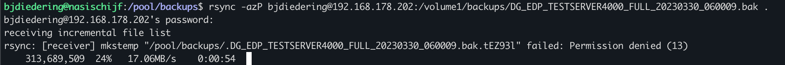

Dat is toch erg?! 17mb/s! Dat gaat voor 10TB aan data (10.000.000mb / 17) = 588235 seconden duren! Ofwel 163 uur! Ofwel 6,8 dagen!
Gelukkig had ik dit van tevoren bedacht en heb ik 2x USB 3.0 naar 2.5gb adapters [gekocht](https://www.amazon.nl/dp/B0CW5YP9BC?ref=ppx_yo2ov_dt_b_fed_asin_title). Die ga ik in beide NASsen prikken, statisch IP adres koppelen en Bob is uwen oom.
In theorie... wordt vervolgd!

> _28-09-2025 ondertussen de 2.5g adapters tussen de Synology en de Jonsbo geprikt, met een cat6a kabel_

#### Netwerk kopieer snelheid
Ok dus ik heb de adapters aangesloten en de kabel zit ertussen. Eerst maar eens kijken of de usb apparaten herkend worden met `lsusb` en tattaaaaaa :

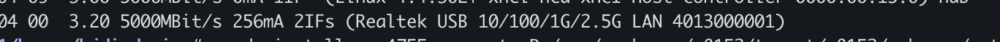

In OMV is het makkelijk, interface toevoegen via Network, Interfaces, Create. 
1. Kies een device (enx00nogwat)
2. Kies method Static
3. Kies een adres : 192.168.100.1
4. Kies dezelfde netmask als de andere interface : 255.255.255.0
5. We hebben geen gateway nodig want we gaan toch net internet niet op.
6. Scroll naar onder naar Advanced Settings en kies MTU 9000 (inderdaad : jumbo frames)
7. Akkordeer de wijzigingen en we zijn goed om te gaan!

In Synology is het wat lastiger. Gelukkig zijn er velen mij voorgegaan in een [oplossing](https://github.com/bb-qq/r8152) als dit met een USB adapter.
1. Omdat ik een Synology DS920+ heb, met _gemini_ chipset, moet ik deze downloaden : https://github.com/bb-qq/r8152/releases/download/2.20.1-1/r8152-geminilake-2.20.1-1_7.2.spk
2. de gedownload .spk onder Package Management een manual install doen.
3. Vinkje voor _Run af ter installation_ uitvinken.
4. Dat faalt, dat was verwacht, daarom deze opdracht uitvoeren : ` sudo install -m 4755 -o root -D /var/packages/r8152/target/r8152/spk_su /opt/sbin/spk_su`
5. Daarna opnieuw proberen, runnen en klaarrrr
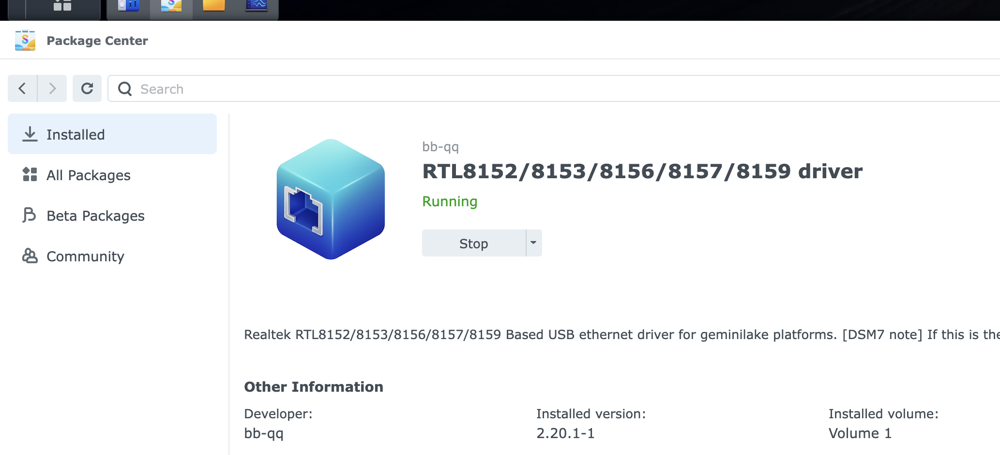
6. Nu is er ook een extra netwerk interface bijgekomen, onder Control Panel, Network : een **LAN 3** 
7. Edit de waarden onder Use Manual Configuration : 
   8. IP = 192.168.100.2
   9. zelfde subnet mask 255.255.255.0
   10. geen gateway en DNS
   11. MTU ook hier op 9000 zetten.
12. Klaar!

Nu wordt het tijd om nog eens een kopieer-actie te doen.

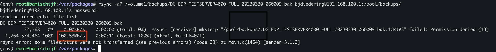

Nouw, kijk, dat gaat al een stuk sneller toch? Eens kijken wat iperf te melden heeft :

```
# Op bamischijf
iperf3 -s

# Op nasischijf
iperf3 -c 192.168.100.2
```
Et voila : 

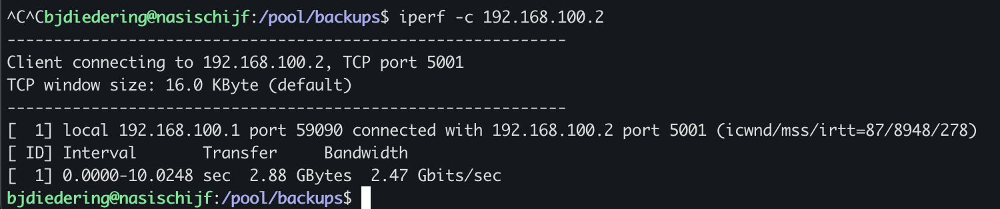

2,88gb aan data in 10 seconden. Whoop whoop :)

Maar waarom heb ik dan nog steeds een data-transfer snelheid van ongeveer 100MB per seconde?
Laat ik eens een andere mogelijke bottleneck (de disks) met `hdparm` onderzoeken op nasischijf : 
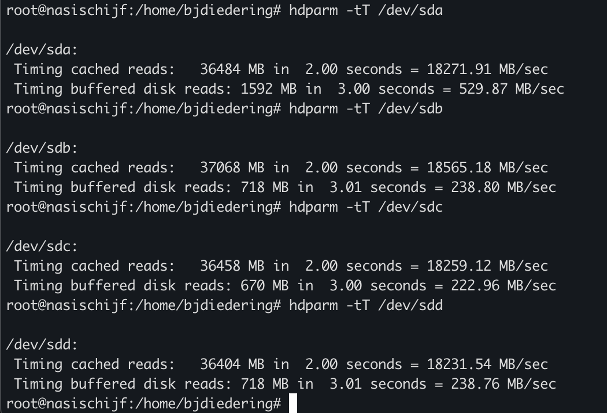

En op bamischijf (Synology) de benchmark op 1 van de schijven : 
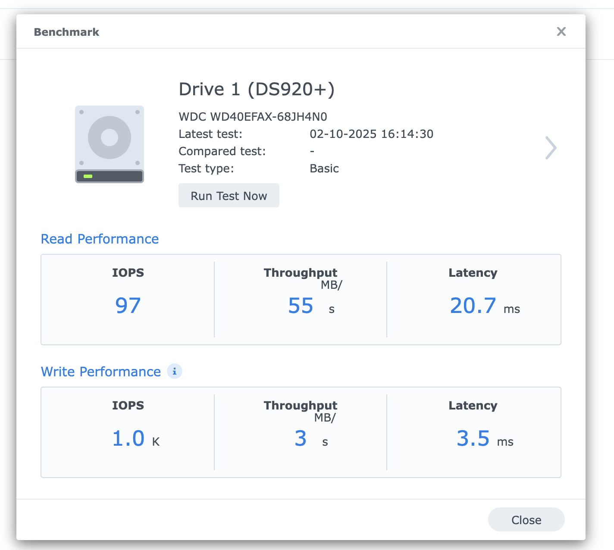

Dus bamischijf is de bottleneck met zn disk snelheid...
Oh well... dan maar 100MB per seconde.

#### extra's
Ondertussen heb ik ook wat vette plugins gevonden vanuit [omv-extra's](https://wiki.omv-extras.org/doku.php?id=start) :
- filebrowser : want soms is het gewoon prettig om bestanden te verplaatsen of renamen met de muis (net zoals in DSM 7)
- nut : want zodra alle data over gezet is, moet nasischijf ook aangesloten worden op mijn [UPS](https://www.bol.com/nl/nl/p/apc-back-ups-950va-noodstroomvoeding-4x-stopcontact).
- scripts : ik heb nu ook scripts die ik op een schedule uitvoer. Maar misschien moet ik hier ook nog maar cron-jobs voor maken...
- snmp : ik heb nu op mijn synology ook SNMP en daar haal ik vrij veel systeem-informatie uit voor een Grafana dashboard.

Ik zat nog te denken aan onedrive plugin, maar dan hang ik weer aan een grote cloudprovider en dat wil ik juist niet. 

#### Notificaties!
Owja als er stront aan de spreekwoordelijke knikker is, moet er natuurlijk een melding in de mail komen. Of misschien op signal, maar dat is een andere blogpost :)
Eens kijken of proton me kan helpen. Ik ben weg bij gmail (of eigenlijk alles van google) dus vandaar proton.
Maar oei oei oei, wat valt dit tegen : Proton ondersteund geen imap of smtp vanwege veiligheid enzo. Leuk, maar ook nergens een vinkje die ik kan aanzetten.
Deze [persoon](https://www.vimoire.com/blog/2025-08-17/Setting-up-ProtonMail-Bridge-on-LAN-server) heeft een oplossing, maar die vind ik nu nog een beetje te spannend. Misschien voor later als ik tailscale uitgeprobeerd heb enzo, dat ik die Proton Mail Bridge kan uitproberen.


