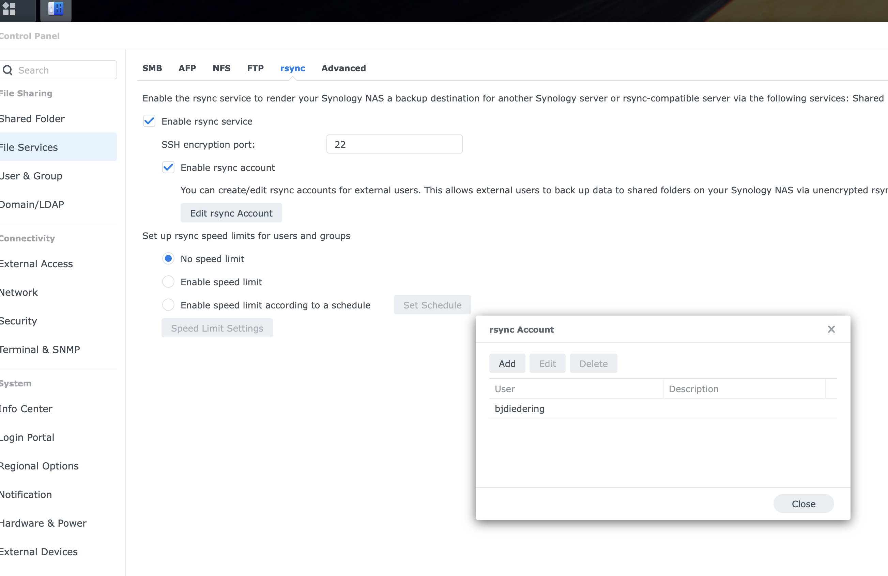
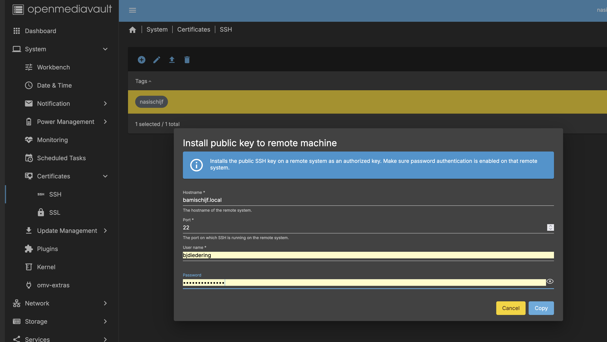
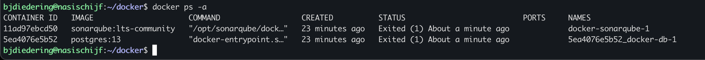
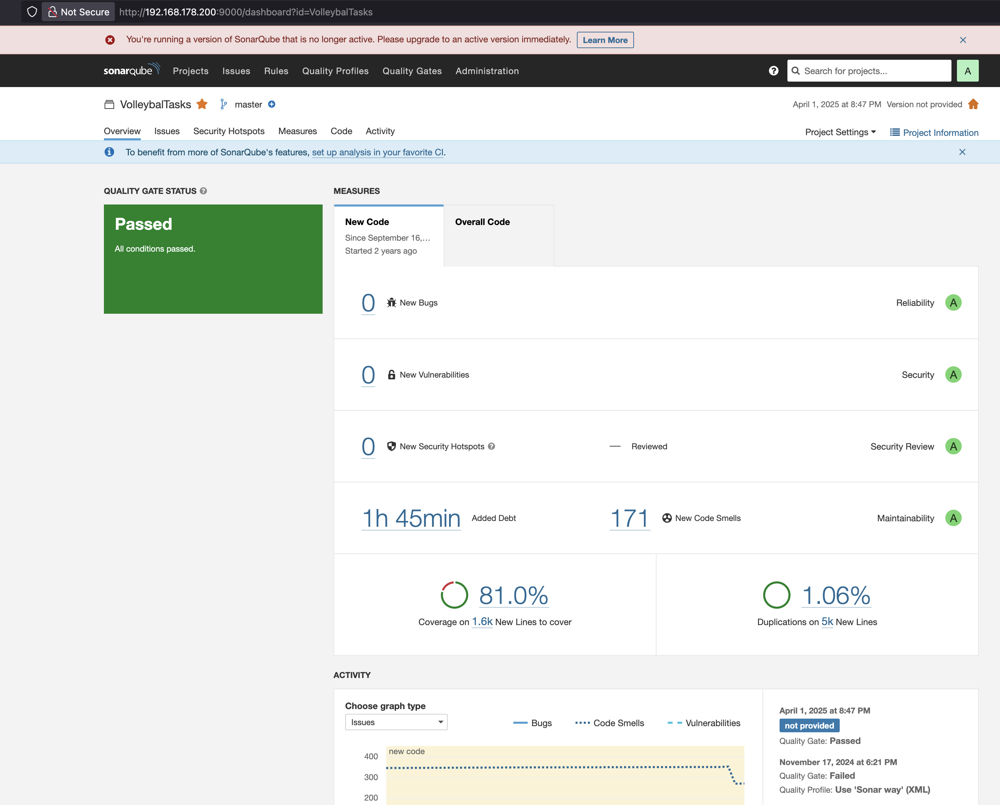
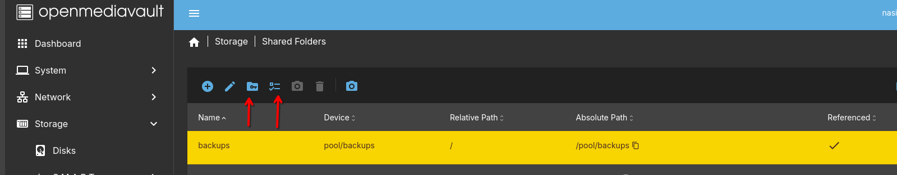
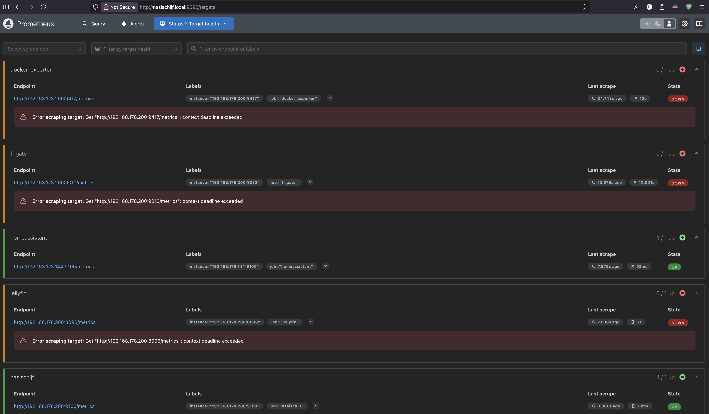

## Project bamischijf 2.0
Mijn huidige NAS heet bamischijf en is een DS920+ van Synology. Maar de 4x4TB in SHR2 zit nu op 80% volheid en na
[deze](https://www.tomshardware.com/pc-components/nas/synology-requires-self-branded-drives-for-some-consumer-nas-systems-drops-full-functionality-and-support-for-third-party-hdds) 
stunt van Synology wil ik eigenlijk geen Synology meer maar mn eigen zelfbouw NAS.
De keuze is gevallen op een Jonsbo N2. Hier heb ik 3x16TB HDD's in, een Intel i5 13500 met 14 cores, 64GB aan geheugen en een 500GB SSD voor het OS.
Het gigabyte moederbord heeft 4 SATA stekkers wat voor nu genoeg is.

> **_Dikke tip :_**
> De fan die bij de jonsbo zit, niet aansluiten onder de molex stekkers maar op het moederbord, zodat je de snelheid kan reguleren.

## Het plan
Zoals [Jim Salter](https://jrs-s.net/2025/08/11/rustdesk-server-on-ubuntu-22-04/) het mooi zegt : _As usual, I’m self-documenting a project while I work on it_ Dat spreekt me wel enorm aan want ik ben niet zo goed in plannen. Ik doe liever.
Kortom, er is geen plan. Ik kan wel een lijstje maken met wat ik nu aan apps, scripts en functionaliteiten op de Synology heb en wat ik straks op 
mijn nieuwe server wil, of nodig ga hebben.

- DSM 7 als frontend om in te klikken
- SHR2 (een soort RAID5)
- Shared Folders (zoals backups, downloads, web, docker, homes)
- file services (AFP voor Mac, NFS, SMB)
- home dirs met daarin o.a. foto's
- apps (zoals synology drive client)
- docker containers
- media en backups
- scripts in de task scheduler
- firewall
- notificatie mogelijkheden
- verbinding met UPS
- fan control
- server monitoring

## Stap 1 : De server installeren
Boven onze voorraadkast in de gang, had ik nog een loze ruimte. Deze ruimte is naast de meterkast, dus het leek me een mooie plek
voor mijn servers. De Frigate-server (een Beelink EQ14) staat er al, mijn nasischijf kan er prima naast :


_Vet he? Ik heb die houten plaat weggeschroeft, kit er omheen weggesneden en een paar keukenkastjes-scharnieren gebruikt, om een deurtje te maken. Nu valt het niet op dat er iets achter zit, en als ik er bij moet dan kan dat :)_

OpenMediaVault gaat mijn frontend worden ipv DSM 7. Het is ook mogelijk om DSM op een niet-Synology te installeren, maar dat voelt als cheaten en lijkt me niet wat.

> _21-09-2025 Zie struikelblok 1 verderop. Installeer dus debian 12!_

En OMV heeft debian nodig dus tsja. Ondertussen heb ik een usb stick met Debian 12 gemaakt. Ik gebruik op mijn laptop KDE Iso Writer. Die vraagt om een checksum.
Een checksum van je iso pakken doe je zo : 
```
sha256sum debian12.iso
```
Het resultaat daarvan plak je in de tool en hoppaaa usb stickie bakken. Dat is cheaten want je moet op de website de sha vinden, maar dat lukte dus niet :)

### SSH
Nu de server een debian install heeft, moet ik nog een ssh server draaien. 
```
sudo apt install openssh-server
```
en daarna starten met `sudo systemctl start ssh` en dan de service enablen zodat ie na een herstart `sudo systemctl enable ssh`.
Draait de ssh service? `sudo systemctl status ssh` Dan kan de server in de kast boven het voorraadhok.
Het enige dat de server nodig heeft is stroom en een UTP kabeltje. 

### Vast ip adres
Eerst maar eens een update doen. 
```
sudo apt update
```
bjdiedering is not in the sudoers file. Okeeeeej. Nouwja ook wel fijn dat niet alles aan staat en ik zelf ook wat moet doen.
`bjdiedering ALL=(ALL:ALL) ALL` toevoegen aan `/etc/sudoers` en klaar. 

```
sudo apt install net-tools dnsutils iproute2 nano
```
En dan een static ip adres in `/etc/network/interfaces` (eerst backup maken!)
```
auto eno1
allow-hotplug eno1
iface eno1 inet static
    address 192.168.178.200
    netmask 255.255.255.0
    gateway 192.168.178.1
    dns-nameservers 8.8.8.8 8.8.4.4
```
Misschien nog een keer niet-google dns-en, maar soit. 
Daar netwerk restarten:
```
sudo systemctl restart networking
```
### Firewall
Nu wil ik een firewall. Ik heb ergens gelezen dat OpenMediaVault ufw ondersteund, maar ik heb ook gelezen dat die niet lief
samen speelt met docker. Maar dat lijkt me een later zorg. 
Eerst maar eens `sudo apt install ufw`. Dan een backup maken van de basis met `sudo cp /etc/default/ufw /etc/default/ufw.backup` en `sudo cp -r /etc/ufw /etc/ufw.backup`
Ik wil nog wel kunnen ssh-en dus `sudo ufw add ssh` 
En een paar basis rules : 
```
sudo ufw default deny incoming
sudo ufw default allow outgoing
sudo ufw default deny forward
```

Aanzetten en we zijn safe `sudo ufw enable`

### Monitoring
Eerst maar eens snel de temps monitoren. 
```
sudo apt install lm-sensors
```
Daarna de sensors vragenlijst starten met `sudo sensors-detect` en daarna kun je met `sensors` zien wat o.a. de temps zijn.


De nasischijf staat al een tijdje in de kast dus dit zijn goeie temps voor een ding dat niet zoveel doet :)

Maar om nu iedere keer te ssh-en en kijken wat o.a. de temperatuur is van alles, ga ik toch liever naar mn grafana dashboard.
Dus we gaan node-exporter installeren :
```
sudo apt install prometheus-node-exporter
```
Dan nog de node-exporter poort 9100 toevoegen aan ufw en klaar is Bert `sudo ufw allow 9100/tcp`


Hierna heb ik de prometheus.yml op mn oude NAS (bamischijf 1.0) aangepast, `docker restart prometheus` en ik kan de metric toevoegen:


Misschien is 25,6 graden niet helemaal zuiver de gemiddelde temperatuur, maar alleszins de temp van teminste 1 CPU core. Mooi woord : alleszins.

### Struikelblok 1
Ik dacht : ik installeer debian 13 want die is de nieuwste. Kom ik er net op dit punt achter dat OpenMediaVault nog niet wordt ondersteund
door [debian 13](https://docs.openmediavault.org/en/latest/releases.html)... Dus ik ga denk ik maar weer opnieuw een installatie doen, 
maar dan met OpenMediaVault 7 met debian12. Zodra OpenMediaVault 8 klaar is, kan ik upgraden naar debian13.

### OpenMediaVault
De installatiehandleiding kan ik niet veel meer van maken dan wat [hier](https://docs.openmediavault.org/en/latest/installation/on_debian.html) staat.
Niet vergeten om na de installatie van OMW mezelf toe te voegen als iemand die mag ssh-en: `sudo usermod -a -G _ssh bjdiedering`
Er staat namelijk duidelijk in de installatie handleiding dat door het installeren van OMV de user die tijdens het installeren
van debian is aangemaakt, niet perse kan ssh-en. 

Na een reboot, naar http://192.168.178.200 en we krijgen een mooi loginscherm te zien : 


Let the fun begin! Voor nu deze post committen naar mn github repo, zodat de blogpost wordt bijgewerkt.

#### Plugins
Laten we beginnen met DNS instellen in de GUI want anders kan ik niet wgetten vanaf een terminal. Klik op Netwerk, Interfaces,
klik op je netwerk-kaart (bij mij was dat eno1), scroll naar beneden en vul een DNS in. Bijvoorbeeld 8.8.8.8 (van google) of 1.1.1.1 (cloudflare)
Nu kun je in je terminal : 
```
wget -O - https://github.com/OpenMediaVault-Plugin-Developers/packages/raw/master/install | bash
```
Als je DNS niet instelt, krijg je deze foutmelding :
`Resolving github.com (github.com)... failed: Temporary failure in name resolution.
wget: unable to resolve host address ‘github.com’`

#### ZFS
Nadat omv-extras is geinstalleerd: refresh de pagina en zoek onder Plugins naar de plugin **openmediavault-kernel** en installeer deze. 
De proxmox kernel is maximaal stabiel en handig als je stabiele ZFS wil draaien heb ik ergens gelezen.
Ga nu (na de page refresh) naar System, Kernel, en kies uit de dropdown de nieuwste proxmox kernel :

Kies een proxmox kernel en zet die als boot. De proxmox kernels eindigen met -pve 

Installeer nu **openmediavault-zfs**. Refresh de pagina weer en ga via Storage naar zfs. Nu moet je dus een naam gaan kiezen.
Iedereen op de interwebs kiest voor "tank". Maar ik dacht eerst aan "deadpool". Maar dat is luguber. Terwijl het misschien wel goed is. 
Deadpool kan iig niet dood.... Kies een naam, kies het type van de pool (ik heb RAID-Z1), kies de disks waar je de pool mee wil maken.
Ik heb 3 disks van 16TB. Vanwege RAID-Z1 krijg heb ik 1 disk voor pariteit en ongeveer 2 disks voor data. 
Technisch gezien zou de totale capaciteit 32 TB moeten zijn, maar de 29TB snap ik ook wel. Ik heb ashift op `12` gezet en compression op `lz4`.
Nu de pool bestaat kan ik een paar filesystems toevoegen zoals backups.


Ik ben er achter gekomen dat als je bijvoorbeeld een NFS of SMB share wil maken, dat je daarvoor eerst een Shared Folder moet maken.
De filesystems die ik heb gemaakt, ga ik ook shared folders voor maken. Als je van het filesystem `/pool/backups` een shared folder wil maken,
is het aan te raden om het relative path **niet** `/backups/` te maken, maar `/` want anders krijg je `/pool/backups/backups` als shared folder.

Tijd om een kopieer-test uit te voeren.
Laat ik eens een SQL Server backup rsync-en van bamischijf naar de nasischijf. Maar dan ben ik niet zo heel erg blij met de overdrachtsnelheid...
Ook al gebruik ik compressie en staan de NASen dicht bij elkaar en zit er een gigabit switch tussen... hier gaat iets niet goed: 


Dat is toch erg?! 17mb/s! Dat gaat voor 10TB aan data (10.000.000mb / 17) = 588235 seconden duren! Ofwel 163 uur! Ofwel 6,8 dagen!
Gelukkig had ik dit van tevoren bedacht en heb ik 2x USB 3.0 naar 2.5gb adapters [gekocht](https://www.amazon.nl/dp/B0CW5YP9BC?ref=ppx_yo2ov_dt_b_fed_asin_title). Die ga ik in beide NASsen prikken, statisch IP adres koppelen en Bob is uwen oom.
In theorie... wordt vervolgd!

> _28-09-2025 ondertussen de 2.5g adapters tussen de Synology en de Jonsbo geprikt, met een cat6a kabel_

#### Netwerk kopieer snelheid
Ok dus ik heb de adapters aangesloten en de kabel zit ertussen. Eerst maar eens kijken of de usb apparaten herkend worden met `lsusb` en tattaaaaaa :


In OMV is het makkelijk, interface toevoegen via Network, Interfaces, Create. 
1. Kies een device (enx00nogwat)
2. Kies method Static
3. Kies een adres : 192.168.100.1
4. Kies dezelfde netmask als de andere interface : 255.255.255.0
5. We hebben geen gateway nodig want we gaan toch net internet niet op.
6. Scroll naar onder naar Advanced Settings en kies MTU 9000 (inderdaad : jumbo frames)
7. Akkordeer de wijzigingen en we zijn goed om te gaan!

In Synology is het wat lastiger. Gelukkig zijn er velen mij voorgegaan in een [oplossing](https://github.com/bb-qq/r8152) als dit met een USB adapter.
1. Omdat ik een Synology DS920+ heb, met _gemini_ chipset, moet ik deze downloaden : https://github.com/bb-qq/r8152/releases/download/2.20.1-1/r8152-geminilake-2.20.1-1_7.2.spk
2. de gedownload .spk onder Package Management een manual install doen.
3. Vinkje voor _Run af ter installation_ uitvinken.
4. Dat faalt, dat was verwacht, daarom deze opdracht uitvoeren : ` sudo install -m 4755 -o root -D /var/packages/r8152/target/r8152/spk_su /opt/sbin/spk_su`
5. Daarna opnieuw proberen, runnen en klaarrrr

6. Nu is er ook een extra netwerk interface bijgekomen, onder Control Panel, Network : een **LAN 3** 
7. Edit de waarden onder Use Manual Configuration : 
   8. IP = 192.168.100.2
   9. zelfde subnet mask 255.255.255.0
   10. geen gateway en DNS
   11. MTU ook hier op 9000 zetten.
12. Klaar!

Nu wordt het tijd om nog eens een kopieer-actie te doen.


Nouw, kijk, dat gaat al een stuk sneller toch? Eens kijken wat iperf te melden heeft :

```
# Op bamischijf
iperf3 -s

# Op nasischijf
iperf3 -c 192.168.100.2
```
Et voila : 


2,88gb aan data in 10 seconden. Whoop whoop :)

Maar waarom heb ik dan nog steeds een data-transfer snelheid van ongeveer 100MB per seconde?
Laat ik eens een andere mogelijke bottleneck (de disks) met `hdparm` onderzoeken op nasischijf : 


En op bamischijf (Synology) de benchmark op 1 van de schijven : 


Dus bamischijf is de bottleneck met zn disk snelheid...
Oh well... dan maar 100MB per seconde.

#### extra's
Ondertussen heb ik ook wat vette plugins gevonden vanuit [omv-extra's](https://wiki.omv-extras.org/doku.php?id=start) :
- filebrowser : want soms is het gewoon prettig om bestanden te verplaatsen of renamen met de muis (net zoals in DSM 7)
- nut : want zodra alle data over gezet is, moet nasischijf ook aangesloten worden op mijn [UPS](https://www.bol.com/nl/nl/p/apc-back-ups-950va-noodstroomvoeding-4x-stopcontact).
- scripts : ik heb nu ook scripts die ik op een schedule uitvoer. Maar misschien moet ik hier ook nog maar cron-jobs voor maken...
- snmp : ik heb nu op mijn synology ook SNMP en daar haal ik vrij veel systeem-informatie uit voor een Grafana dashboard.

Ik zat nog te denken aan onedrive plugin, maar dan hang ik weer aan een grote cloudprovider en dat wil ik juist niet. 

#### Notificaties!
Owja als er stront aan de spreekwoordelijke knikker is, moet er natuurlijk een melding in de mail komen. Of misschien op signal, maar dat is een andere blogpost :)
Eens kijken of proton me kan helpen. Ik ben weg bij gmail (of eigenlijk alles van google) dus vandaar proton.
Maar oei oei oei, wat valt dit tegen : Proton ondersteund geen imap of smtp vanwege veiligheid enzo. Leuk, maar ook nergens een vinkje die ik kan aanzetten.
Deze [persoon](https://www.vimoire.com/blog/2025-08-17/Setting-up-ProtonMail-Bridge-on-LAN-server) heeft een oplossing, maar die vind ik nu nog een beetje te spannend. Misschien voor later als ik tailscale uitgeprobeerd heb enzo, dat ik die Proton Mail Bridge kan uitproberen.

> _13-10-2025 Ondertussen heb ik rsync-tasks aan de praat en de meeste data is over. Tijd voor een update_

### Rsyncen
Ondertussen heb ik rsync-tasks gemaakt voor iedere shared directory. Met een rsync task hoef ik de terminal niet open te laten
staan om een rsync te doen. Het is mogelijk de rsync-tasks te schedulen met cron, maar ik laat ze disabled zonder schedule.
Aantal settings op de synology : 



Dan gaan we op OMV een SSH key pair maken : 


Vervolgens kun je deze key installeren op bamischijf :



Deze key verschijnt dan in de `~/.ssh/authorized_keys` op de Synology.
Daarna gaan we een rsync task aanmaken in OMV:


> Let op deze enable ik dus niet want ik wil em 1x runnen en daarna wanneer ik dat nodig vindt. 

Het rsyncen kost de synology namelijk behoorlijk wat resources. Tegelijkertijd rsyncen EN jellyfinnen is niet te doen. 
Ik moet dus ook het kopieren van de grootste bulk aan data goed plannen. Maar ik moet ook thuis zijn, want ik wil af en toe 
voelen hoe warm de USB 3.2 naar 2.5gbps adapters worden...

> _20-10-2025 Okay ik wou dus docker gaan installeren en mn compose files weer up brengen. Maar ik kwam dus eerst iets anders tegen._

### Dockeren
Nu alles zo'n beetje over is qua data, is het zaak dat ik de dockers die we thuis gebruiken, weer aan de praat krijg op nasischijf.
Maar na het installeren van docker had ik gelezen : doe ff reboot als je tegen een vervelende error :

`permission denied while trying to connect to the Docker daemon socket at unix:///var/run/docker.sock: Get "http://%2Fvar%2Frun%2Fdocker.sock/v1.51/containers/json": dial unix /var/run/docker.sock: connect: permission denied`

Maar ik had de docker group al gemaakt, $USER aan toegevoegd en permissions gezet, ik kon de docker.sock benaderen. Maar `docker ps` resulteerde in bovenstaande foutmelding. Dus een reboot.
Toen kon ik OMV niet meer benaderen. Hoe dan?! Dus met het handje de server uitgezet (auw sorry harddisks en andere hardware).  Ik naar boven met de nasischijf, koppelen aan monitor en keyboard.
Start ie in een blauwe prompt met de keuze op memtest! Nee! Dus ik 4x pijltje naar boven de nieuwste kernel kiezen en gaan. Dikke prima niks aan de hand. 
Softwarematig de nasischijf weer afgesloten en beneden in kast weer aangesloten. Met de 2.5g usb NIC maar weer geen ping of andere connectie naar nasischijf.
Dus ik weer een herstart doen, maar nu via toetsenbord en de 2.5g usb NIC eruit. Even wachten op numlock. Numlock uit en 4x pijltjetoets naar boven en ENTER.
Et voila! Ik kan weer bij nasischijf :) Okay nog een keer `docker ps` als mijn user : presto! U gaat door voor de koelkast.

Nu denk ik 2 dingen: 
1. Wat ging er mis?
2. Moet ik een KVM switch?

> _25-10-2025 Vandaag weer even tijd. Ik was van plan mijn dockers weer aan de praat te krijgen, maar toen zag ik bovenstaande onopgelost probleem nog staan_

#### Wat ging er mis?
Nu weet ik het niet zeker, maar het lijkt er dus op dat ik de proxmox kernel nooit goed heb geinstalleerd of in ieder geval als Default heb gezet.
Ik had dus na het installeren van de proxmox-kernel (die de zfs-tools bevat) deze pve kernel als default moeten zetten. 


#### Moet ik een KWVM switch?
Nee. Die dingen zijn duur. Ik zou er zelf 1 in elkaar kunnen fabrieken maar dan heb ik een raspberry pi nodig (nog een stroom aansluiting) en nog meer tijd.
Daarbij: zo vaak verwacht ik niet dat ik het grub menu nodig heb. Wel speel ik nog met het idee om een kleine monitor bij een plaatselijke kringloop te scoren.
Ruimte zat waar nasischijf staat. Er ligt ook al een toetsenbord bij. Voor nu is dit van latere zorg. Ik vind het alleen geen prettig idee dat ik de server na een herstart niet kan 
benaderen omdat ie blijft hangen in een boot-menu. Op een later tijdstip ga ik me verdiepen in grub menu. Ik wil nu eerst containers heen en weer gooien :)

### Dockeren part deux
Okay, ik heb dus een /pool/docker waar ik alles van bamischijf heen heb gekopieerd. De docker-compose files heb ik onder mn eigen account op de nasischijf geplaatst.
Mijn plan is om de compose files in de home folder te zetten en de volumes naar /pool/docker te laten wijzen. De compose files die ik niet meer gebruik of nodig heb, 
heb ik ondertussen verwijderd. De rest ga ik omsmurfen naar gebruik op nasischijf.

#### sonarqube
Ooit ben ik een cicd omgeving gestart met gitlab en jenkins en sonarqube, maar daar is alleen sonarqube van overgebleven.
Tot mijn grote schrik zie ik dat de docker-compose.cicd.yml volumes gebruikt die docker zelf mag bedenken.
Dat wil ik dus niet, ik wil dat ze in /pool/docker komen. Maar dat betekent ook dat ik de volume data van volumes moet kopieren/migreren naar `/pool/docker`.
Werkt dat uberhaupt? Laten we het uitproberen.

Eerst de `docker_*` folders overkopieren naar de `/pool/docker/` op nasischijf. Dit doe ik vanaf bamischijf omdat ik daar root moet zijn om die `@docker` folder te zien.

```
rsync -aP docker_* bjdiedering@192.168.100.1:/pool/docker/
```

Zodra die folders op de nasischijf staan eerst maar eens een rename, want ik ga geen volledige cicd straat lokaal installeren.

`mv docker-compose.cicd.yml docker-compose.sonarqube.yml`

Daarna kijken wat we moeten aanpassen. De volumes moeten expliciet worden genoemd.

```yaml
version: "3"

services:
  sonarqube:
    image: sonarqube:lts-community #sonarqube:8.9.3-community
    hostname: sonarqube
    depends_on:
      - db
    environment:
      SONAR_ES_BOOTSTRAP_CHECKS_DISABLE: true
      SONAR_SEARCH_JAVAADDITIONALOPTS: "-Dbootstrap.system_call_filter=false"
      SONAR_JDBC_URL: jdbc:postgresql://db:5432/sonar
      SONAR_JDBC_USERNAME: sonar
      SONAR_JDBC_PASSWORD: sonar
    volumes:
      - sonarqube_data:/opt/sonarqube/data
      - sonarqube_extensions:/opt/sonarqube/extensions
      - sonarqube_logs:/opt/sonarqube/logs
    ports:
      - "9000:9000"
  db:
    image: postgres:13
    environment:
      POSTGRES_USER: sonar
      POSTGRES_PASSWORD: sonar
    volumes:
      - postgresql:/var/lib/postgresql
      - postgresql_data:/var/lib/postgresql/data

volumes:
  sonarqube_data:
  sonarqube_extensions:
  sonarqube_logs:
  postgresql:
  postgresql_data:
```

Dat pas ik aan naar dit : 

```yaml
version: "3"

services:
  sonarqube:
    image: sonarqube:lts-community #sonarqube:8.9.3-community
    hostname: sonarqube
    privileged: true
    depends_on:
      - db
    environment:
      SONAR_ES_BOOTSTRAP_CHECKS_DISABLE: "true"
      SONAR_SEARCH_JAVAADDITIONALOPTS: "-Dbootstrap.system_call_filter=false"
      SONAR_JDBC_URL: "jdbc:postgresql://db:5432/sonar"
      SONAR_JDBC_USERNAME: "sonar"
      SONAR_JDBC_PASSWORD: "sonar"
    volumes:
      - ${DOCKER}/sonarqube/sonarqube_data:/opt/sonarqube/data
      - ${DOCKER}/sonarqube/sonarqube_extensions:/opt/sonarqube/extensions
      - ${DOCKER}/sonarqube/sonarqube_logs:/opt/sonarqube/logs
    ports:
      - "9000:9000"
  db:
    image: postgres:13
    hostname: postgres_sonarqube
    privileged: true
    environment:
      POSTGRES_USER: "sonar"
      POSTGRES_PASSWORD: "sonar"
    volumes:
      - ${DOCKER}/sonarqube/db:/var/lib/postgresql
      - ${DOCKER}/sonarqube/db_data:/var/lib/postgresql/data
```

En dan uppen die hap: `docker-compose -f docker-compose.sonarqube.yml up -d` en nog 9000 als poort allowen : `sudo ufw allow 9000`
Helaas... een foutmelding : 

```dockerfile
Recreating docker-db-1 ...

ERROR: for docker-db-1  'ContainerConfig'

ERROR: for db  'ContainerConfig'
Traceback (most recent call last):
  File "/usr/bin/docker-compose", line 33, in <module>
    sys.exit(load_entry_point('docker-compose==1.29.2', 'console_scripts', 'docker-compose')())
             ^^^^^^^^^^^^^^^^^^^^^^^^^^^^^^^^^^^^^^^^^^^^^^^^^^^^^^^^^^^^^^^^^^^^^^^^^^^^^^^^^
```
Okay misschien dan eens `docker compose -f docker-compose.sonarqube.yml up -d`
Dat ziet er al beter uit : 


Maar helaas geen containers up `docker ps -a` : 



Wat staat er in de logs?
```
The files belonging to this database system will be owned by user "postgres".
This user must also own the server process.

The database cluster will be initialized with locale "en_US.utf8".
The default database encoding has accordingly been set to "UTF8".
The default text search configuration will be set to "english".

Data page checksums are disabled.

initdb: error: directory "/var/lib/postgresql/data" exists but is not empty
If you want to create a new database system, either remove or empty
the directory "/var/lib/postgresql/data" or run initdb
with an argument other than "/var/lib/postgresql/data".
The files belonging to this database system will be owned by user "postgres".
This user must also own the server process.

The database cluster will be initialized with locale "en_US.utf8".
The default database encoding has accordingly been set to "UTF8".
The default text search configuration will be set to "english".

Data page checksums are disabled.

initdb: error: directory "/var/lib/postgresql/data" exists but is not empty
If you want to create a new database system, either remove or empty
the directory "/var/lib/postgresql/data" or run initdb
with an argument other than "/var/lib/postgresql/data".
```

Na wat verwoede pogingen om dit aan de praat te krijgen ga ik toch maar een backup maken van de huidige database en te 
restoren in de nieuwe omgeving. Eerst de bestaande niet opstartende docker containers verwijderen 
met `docker rm <docker id>` en daarna de backup maken van de huidige database van de container op bamischijf :
```docker exec 843bf2c6dac8 pg_dump -U sonar -F t sonar > sonarqube.sql```

En de backup scp-en vanaf bamischijf naar de nasischijf:

`scp sonarqube.sql bjdiedering@192.168.100.1:/pool/docker/`

Dan in eerste instantie de docker compose draaien zodat ik een kale/lege sonarqube heb.
Ook de folders leegmaken die ik ga gebruiken voor de volumes, want anders krijg ik weer die initdb error.

`docker compose -f docker-compose.sonarqube.yml up -d`

Vervolgens de sonarqube.sql restoren vanuit de database container: 

`docker exec -i a271985fa757 pg_restore -U sonar -d sonar --clean --if-exists < /pool/docker/sonarqube.sql`

En dan hopen dat alles werkt. En jawel, na inloggen op sonarqube op poort 9000, zie ik mijn projecten weer terug :)



#### portainer
De volgende is portainer. Die is makkelijk want die gebruikt geen gekke volumes ergens. Wel een portainer folder maar die heb ik leeg gemaakt.
Ik heb immers nog niet alle containers overgezet.

```yaml
version: '3'

services:
  portainer:
    image: portainer/portainer-ce:latest
    container_name: portainer
    restart: unless-stopped
    privileged: true
    security_opt:
      - no-new-privileges:true
    volumes:
      - /etc/localtime:/etc/localtime:ro
      - /var/run/docker.sock:/var/run/docker.sock:z
      - ${DOCKER}/portainer:/data
    ports:
      - 8000:8000
      - 9443:9443
      - 9001:9000

  watchtower:
    container_name: watchtower
    image: containrrr/watchtower
    privileged: true
    volumes:
      - /var/run/docker.sock:/var/run/docker.sock
      #- /etc/timezone:/etc/timezone:ro
    command: --interval 86400 --http-api-metrics --http-api-token demotoken
    environment:
      #- WATCHTOWER_RUN_ONCE=true
      - WATCHTOWER_CLEANUP=true
    labels:
      - "com.centurylinklabs.watchtower.enable=true"
    ports:
      - 8889:8080
```

Wel kleine aanpassingen aan de docker compose file gedaan: poort 9000 van portainer heb ik veranderd naar 9001, want die gebruik ik al voor sonarqube.
Tevens privileged true gezet, want anders kreeg ik deze error bij het starten van de containers in de compose file:
```config
Got permission denied while trying to connect to the Docker daemon socket at unix:///var/run/docker.sock
```

Vooral die ```/var/run/docker.sock:/var/run/docker.sock:z``` volume is belangrijk, want daarmee kan portainer de docker daemon benaderen en hoef ik verder geen settings te maken.


> _04-11-2025 Na portainer is het tijd voor de monitoring stack_

#### monitoring
Okay ik heb een docker compose file met allemaal monitoring shizzle er in. Grafana, influxdb (de oude), paar exporters, je kent het wel.
Maar postgres_dwh kwam niet op, omdat ik natuurlijk de data folder al had en ik had nog geen schone lei. De initdb functie wordt ogpestart bij het starten van de container.

```angular2html
initdb: error: directory "/var/lib/postgresql/data" exists but is not empty

initdb: hint: If you want to create a new database system, either remove or empty the directory "/var/lib/postgresql/data" or run initdb with an argument other than "/var/lib/postgresql/data".
```

Nou! Lijkt me duidelijk toch? Dus ik SMB-share openen om "ff" makkelijk die folder te yeeten. Niet dus. Want ik had nog geen SMB shares gemaakt. Easy peasy toch? Gewoon in OpenMediaVault SMB service enablen met wat default settings en klaar?
Wrong. Je moet per share de permissions nog instellen :



Dan als alle settings van Samba goed zijn aangezet, moet ik stiekem nog in `ufw` allowen: 
```sudo ufw allow Samba```

En nog het sambawachtwoord zetten. Waarom? Geen idee, anders kan ik niet inloggen als mijn user.
```sudo sambapasswd -a bruuteuzius```

Na een `docker compose -f ~/docker/docker-compose.monitoring.yml up -d` draaien, was zowat alles groen in portainer, maar postgres_dwh had errors in de log.
Ik had een data folder gemapped die niet leeg was. Dus ik heb als root die folder leegemaakt. Ook moest ik nog de poort 54321 allowen in de firewall : `sudo ufw allow 54321`
Daarna kon ik postgres_dwh starten. Nu moet ik een vergelijkbare actie als eerst uitvoeren, om mijn DWH te backuppen van de bamischijf en te restoren in nasischijf.

Ondertussen heb ik ook prometheus bekeken of die het doet. Er werden dankzij de prometheus.yml nog bamischijf exporters bezocht. 
Dus ik heb alle bamischijf ip-adressen vervangen door nasischijf ip-adres. Daarna een `docker restart prometheus` en nu haalt ie (bijna) alles van de exporters die op nasischijf zijn geinstalleerd dankzij de docker-compose.monitoring.yml



Er zijn nog een heleboel targets rood, dus die metrics doen het nog niet. Moet ik dus nog fixen. Een andere keer...


> _07-11-2025 Weer even tijd gehad om uit te zoeken waarom sommige metrics het niet deden._

De meeste die rood waren, was een poorten-issue! Ik heb natuurlijk in het begin ufw geinstalleerd en wel wat poorten toegevoegd, maar niet alle.
Dus ik heb de poorten toegevoegd die ik in de docker-compose.monitoring.yml had staan met [tufw](https://github.com/peltho/tufw). 
Dit is een vette tool die je helpt met het beheren van ufw via een terminal interface.


Nu prometheus weer goed werkt, kan ik misschien wel eens een keer een nieuw grafana dashboard maken.
Belangrijker lijkt me misschien wel postgresql_dwh aan de praat krijgen, want dat vind ik wel belangrijk.

#### media
Het aanzetten van mn `docker-compose.media.yml` ging vrij soepel. Ik kon alleen nog niet downloaden. Stom ook want ik kwam er 
echt laat achter dat ik de settings van de bamischijf naar nasischijf had overgekopieerd. Dus ik was in sonarr en radarr aan de downloads naar de deluge van bamischijf aan het sturen.
Nadat ik dat had aangepast naar nasischijf, werkte het downloaden weer als vanouds.

#### postgresql_dwh
Alle data van home assistant van die dag, kopieer ik iedere nacht om 01:00 met een bash-script op de synology, van de mariadb database 
van home assistant, naar mijn eigen DataWarehouse in postgresql_dwh. Hiervoor gebruik ik een combinatie van een python script, en wat code en vieuws in de postgres_dwh.
Om dat ook op de nasischijf te laten werken, moet ik eerst een backup maken van data uit de bamischijf postgresql_dwh container en restoren in de postgres_dwh 
database op de nasischijf. Maar dan moet ik er eerst bij kunnen. Ik heb de poort 54321 (uit de docker-compose.monitoring.yml) in ufw toegevoegd, maar ik krijg een connection refused.

Ik heb de postgres_dwh container gestopt, de data folder leeggemaakt (want die had ik al gekopieerd vanaf bamischijf) en daarna de container weer gestart.
Toen ik de data folder wou leegsmijten, heb ik gezien dat de rechten niet goed stonden. Dus ik heb de eigenaar van de folder veranderd naar mezelf en users met chown :
`sudo chown -R bjdiedering:users /pool/docker/postgresql_dwh/data/`
Daarna kon ik de container starten. Maar nog steeds geen connectie. Wat nu weer?
Blijkbaar had ik in mijn verwoede pogingen om de container aan de praat te krijgen nog een pg_hba.conf aangepast, met blijkbaar een interne poort naar 54321. Dus ik die weer teruggezet naar de originele versie.

Nu is het tijd om een backup te maken van de bamischijf postgresql_dwh database.
```
docker exec docker-postgres_dwh-1 pg_dump -U postgres -F t postgres > postgres_dwh.sql
```

Vervolgens die backup scp-en naar nasischijf :
```
scp postgres_dwh.sql bjdiedering@192.168.100.1:/pool/docker/
```

Daarna de database restoren in de nasischijf postgresql_dwh container :
```
docker exec -i docker-postgres_dwh-1 pg_restore -U postgres -d postgres --clean --if-exists < /pool/docker/postgres_dwh.sql
```
En jawel! Ik kan weer inloggen met DBeaver en zie mijn tabellen weer terug :)


Het script dat op bamischijf iedere nacht om 01:00 draait, krijg ik niet snel aan de praat met python venv en gedoe.
Dus ik heb het script omgesmurft naar een self-contained c# console app. Die werkt prima op nasischijf want het is gewoon een executable.
Dat wordt een andere blogpost waarin ik dat lelijke ding dat ik snel in elkaar heb geflanst, netjes ga uitleggen en ga refactoren.

In een volgende aanpassing aan deze blogpost, wil ik kijken of de import is gelukt met de in elkaar gehackted c# tool.

> 10-11-2025 De C# tool werkt, maar nog niet in een cron-job die ik bij elkaar heb geklikt in OpenMediaVault.

Want ik krijg deze error : 
```config
Failed to execute command 'export PATH=/bin:/sbin:/usr/bin:/usr/sbin:/usr/local/bin:/usr/local/sbin; export LC_ALL=C.UTF-8; export LANGUAGE=; export SHELL=/bin/sh; sudo --shell --non-interactive --user='bjdiedering' -- /var/lib/openmediavault/cron.d/userdefined-ee57b243-cf55-4d01-a597-5158d7cbf8f7 2>&1' with exit code '1': Error: Access to the path '/homeassistant_export.csv' is denied.

OMV\ExecException: Failed to execute command 'export PATH=/bin:/sbin:/usr/bin:/usr/sbin:/usr/local/bin:/usr/local/sbin; export LC_ALL=C.UTF-8; export LANGUAGE=; export SHELL=/bin/sh; sudo --shell --non-interactive --user='bjdiedering' -- /var/lib/openmediavault/cron.d/userdefined-ee57b243-cf55-4d01-a597-5158d7cbf8f7 2>&1' with exit code '1': Error: Access to the path '/homeassistant_export.csv' is denied. in /usr/share/openmediavault/engined/rpc/cron.inc:198
Stack trace:
#0 /usr/share/php/openmediavault/rpc/serviceabstract.inc(628): Engined\Rpc\Cron->Engined\Rpc\{closure}()
#1 /usr/share/openmediavault/engined/rpc/cron.inc(176): OMV\Rpc\ServiceAbstract->execBgProc()
#2 [internal function]: Engined\Rpc\Cron->execute()
#3 /usr/share/php/openmediavault/rpc/serviceabstract.inc(124): call_user_func_array()
#4 /usr/share/php/openmediavault/rpc/rpc.inc(86): OMV\Rpc\ServiceAbstract->callMethod()
#5 /usr/sbin/omv-engined(546): OMV\Rpc\Rpc::call()
#6 {main}
```
Dit komt omdat de cron-job die ik heb aangemaakt in OpenMediaVault, standaard als root draait. Ik dacht slim te zijn en die als
mijn eigen user te draaien, maar dat moet toch root zijn blijkbaar. Nadat ik dit had aangepast, update de C# tool mijn DWH als een modderflipper :)

#### tools
Ondertussen heb ik ook de docker-compose.tools.yml aangeslingerd. Hieraan heb ik nginx toegevoegd. 
Op mijn oude NAS (bamischijf) draaide onder DSM 7 een fancy pancy webserver. Daar had ik een index.html gemaakt met grote knoppen waarmee ik
vrij eenvoudig de (die ik dankzij al die dockers had) kon benaderen. Dat wil ik nu ook op nasischijf dus heb ik nginx toegevoegd.
bamischijf vervangen door nasischijf in de index.html en klaar is Bert. Kiek dan, mooi landing page: 


Tools bevat verder bookstack met bijbehorende mariadb database en phpmyadmin (for the lolz). 

#### unifi controller verhuizen
Ik heb de unifi controller ook geinstalleerd op nasischijf. Hiervoor had ik een aparte blogpost geschreven [Unifi Controller op Docker](https://bjdiedering.nl/blog/unifi-controller-op-docker/)
Nu moet ik dus zorgen dat de AP's de nieuwe controller op nasischijf gaan vinden.

#### jellyfin
Nu moet ik toch echt wel jellyfin gaan migreren naar nasischijf en dan kan ik de dockers van bamischijf uitzetten.
Ik denk dat ik jellyfin geen losse docker-compose ga geven, maar bij docker-compose.media.yml ga toevoegen.

> _12-11-2025 Jellyfin proberen te verhuizen naar nasischijf._

Mijn plan is : 
1. de nieuwste series en films van bamischijf naar nasischijf kopieren met de rsync tasks.
2. dan de docker van jellyfin op bamischijf stoppen
3. dan de docker-compose.media.yml aanpassen met de jellyfin volumes naar nasischijf
4. dan en rsync doen van alle jellyfin data van bamischijf naar nasischijf
5. dan de docker-compose.media.yml uppen

> _16-11-2025 Jellyfin verhuizen._

Jellyfin toevoegen aan de docker.compose.media.yml was niet gelukt om jellyfin te starten. Ik kreeg een migratie error in de logs.
Een backup maken van jellyfin vanaf de bamischijf en restoren op de nasischijf hielp ook niet.
Toen heb ik op de nasischijf de bestaande `config` map leegegooid en de `cache` map verwijderd. 
Vanaf bamischijf heb ik toen een rsync gedaan van de `config` map naar de nasischijf, zodat ik geen permission denied kreeg op bepaalde bestanden. 
```config
rsync -aP config/ bjdiedering@192.168.100.1:/pool/docker/jellyfin/config/
```

Daarna de docker-compose.media.yml uppen en jellyfin starten. En jawel! Jellyfin draait op nasischijf :)
Vervolgens heb ik onze telefoons naar de nieuwe jellyfin server laten verwijzen en de tv-app ook. We zijn over!

### Afronding van dit verhuisproject.
Ondertussen ben ik redelijk up and running met alles op nasischijf. Laat ik mijn lijstje er nog eens bijpakken :
- [x] DSM 7 als frontend om in te klikken 
- [x] SHR2 (een soort RAID5)
- [x] Shared Folders (zoals backups, downloads, web, docker, homes)
- [x] file services (AFP voor Mac, NFS, SMB) --> ja SMB shares maar nog bijvoorbeeld geen dlna voor muziek
- [x] home dirs met daarin o.a. foto's --> wel foto's overgekopieerd maar nog geen `immich`
- [ ] apps (zoals synology drive client) --> nog niet, idee is `syncthing`
- [x] docker containers
- [x] media en backups (poah wat een boel data over de lijn!)
- [x] scripts in de task scheduler --> in ieder geval de belangrijkste: mijn DWH import
- [x] firewall --> gedoe met ufw
- [ ] notificatie mogelijkheden --> lukte niet echt met proton mail, dus moet iets anders verzinnen
- [ ] verbinding met UPS --> wil ik binnenkort op een woensdagmiddag gaan doen
- [ ] fan control --> dat kan ik in de bios, maar wil ik nog via een script of een frontendje doen
- [x] server monitoring --> prometheus en grafana doen het, dashboard moet nog geupdate worden met bijvoorbeeld data uit `collectd`

Ondertussen heb ik op een linux-podcast gehoord dat synology zijn plannen om alleen eigen harddisks te ondersteunen weer terugdraait.
Maar ik vertrouw ze toch niet. Liever mn eigen hardware en software in eigen beheer. En ik heb bakken met ruimte nu :)
