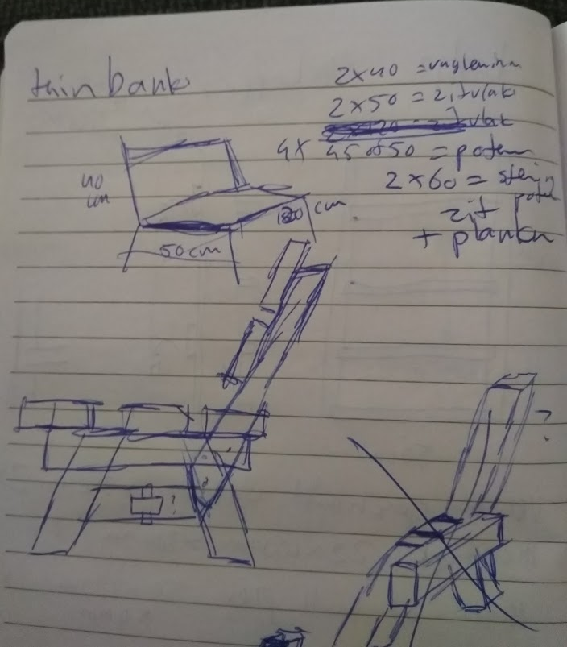
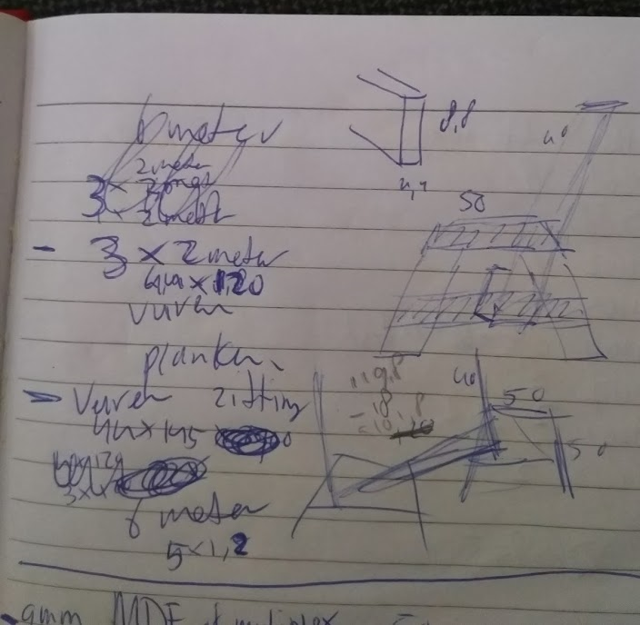
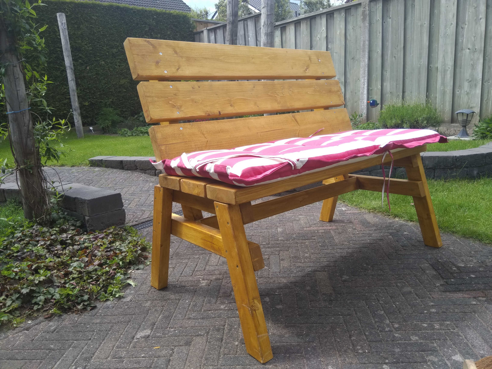

Een man en zijn schuur is blijkbaar een ding. Nooit bij stilgestaan, maar stiekem is het best prettig om iets met je handen te maken als je de hele dag achter je laptop zit. Mijn voorkeur gaat uit naar hout.

We hadden bedacht dat een bankje voor in de tuin wel handig zou zijn. Omdat ik best groot ben (2 meter) is zo’n gammel tuinbankje van de bouwmarkt niets voor ons. Bovendien past het tuinstoelkussen dat we nog hebben daar niet in.

Dus : zelf maken!

Ik had een [youtube filmpje](https://www.youtube.com/watch?v=LuiuJLbZBh4) gevonden, maar verder niet naar de maten gekeken. Slimme Henkie dat ik ben heb ik eerst wat opgemeten en toen een tekening gemaakt :

  
Daarna heb ik bij houthandel [Kienhuis](https://www.handelsondernemingkienhuis.nl/) wat hout gehaald (geschaafd vuren) en wat 7cm schroeven, want de dikte van de balken is 4,4cm en we willen natuurlijk geen schroefpunten in de rug of in je zitvlak 😅.

Voordat de schroeven er in gaan is voorboren belangrijk, want anders kan hout splijten; Zeker vurenhout.

Bij de Hubo heb ik wat transparante beits opgehaald. Deze moet je wel goed roeren, want het is een grof papje. Dikke tip van m'n zwager is : de stukken waar je later niet meer goed bij kan alvast beitsen.

Met een waterpas en een paar lijmklemmen kun je makkelijk alle delen recht monteren.

Dit is dan het resultaat : een bankje waar je eventueel met een paar mensen van 100 kilo wel op zou kunnen zitten😅
